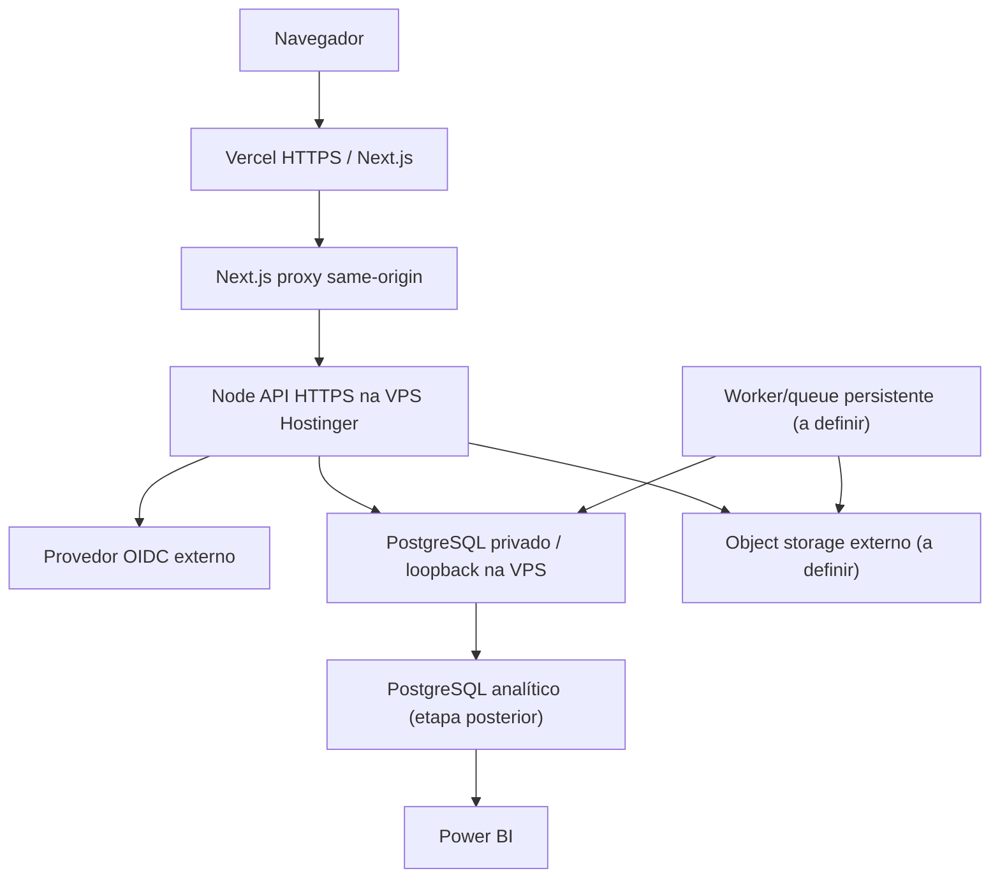
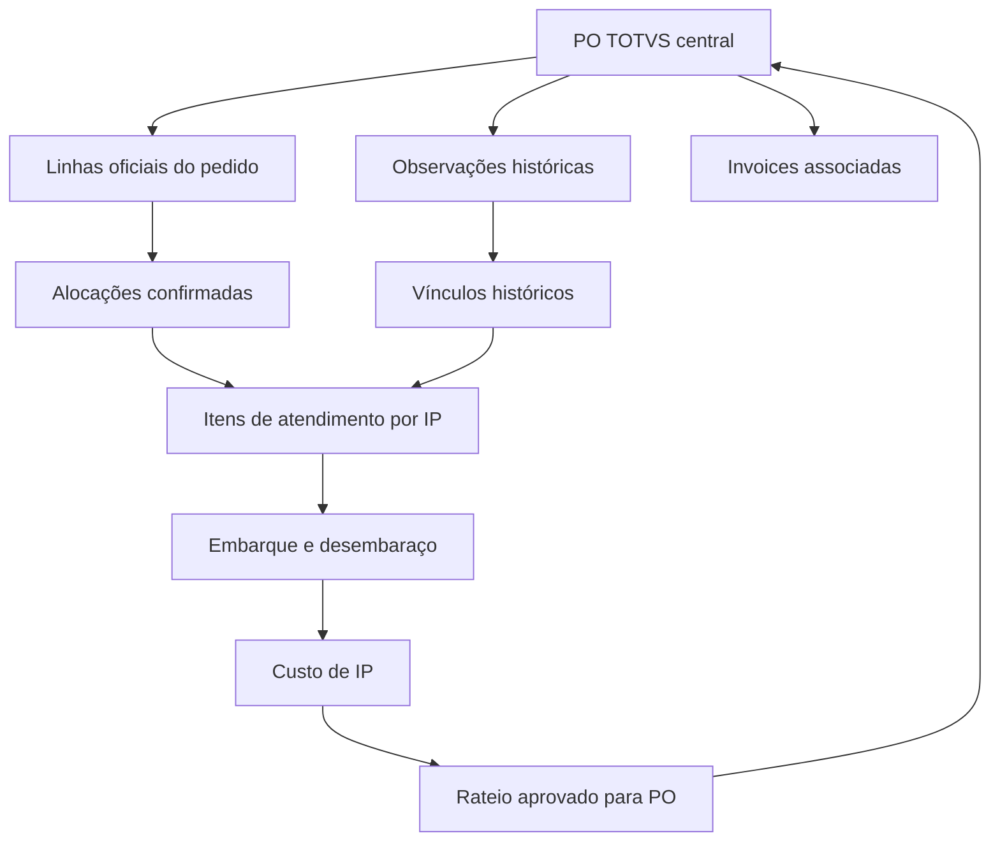
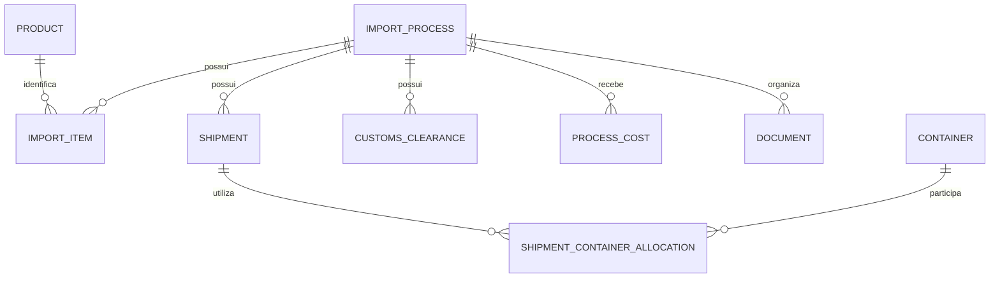
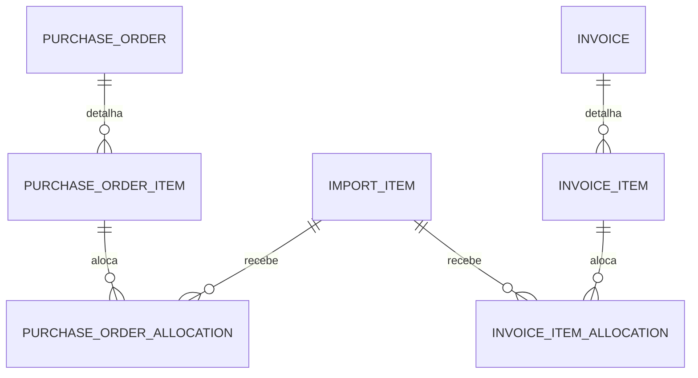

# Plano completo do ERP de acompanhamento de POs TOTVS e importações

**Especificação para desenvolvimento — versão 1.1 — 24 de setembro de 2026**

Este documento define o produto, a arquitetura de dados, a stack, os contratos técnicos e a sequência de implementação de um ERP de importações. É a referência de trabalho para produto, desenvolvimento, dados, qualidade e infraestrutura. A implementação será realizada no ambiente de desenvolvimento da equipe. Esta entrega é um plano técnico; não é uma aplicação implantada nem uma declaração de que os componentes já foram construídos.

A **PO TOTVS é a entidade central de negócio e o ponto de entrada operacional**. O IP representa uma execução logística vinculada aos itens do pedido. Uma PO pode ser atendida por vários IPs; um IP pode reunir itens de várias POs. O desenho de telas, permissões, indicadores e rastreabilidade parte dessa relação.

A arquitetura de aplicação escolhida pelo Product Owner em 24 de setembro de 2026 é **Next.js/React/TypeScript na Vercel Free**, com **API Node.js + PostgreSQL privados na mesma VPS Hostinger**. Next.js usa `proxy.ts` para encaminhar `/auth/*` e `/api/v1/*` server-side para a API por HTTPS com token de gateway; a conexão do banco não sai da VPS e a porta PostgreSQL não é publicada. A API e o PostgreSQL serão serviços persistentes na VPS, independentes do computador pessoal. OIDC, storage de arquivos e processamento durável serão serviços externos configurados por ambiente. ASP.NET Core, SQLite, Compose, Keycloak e Azurite no repositório são legado/ferramentas de transição, não o runtime alvo. A migração precisa preservar regras/contratos e iniciar com os valores históricos das duas abas; publicar apenas a interface vazia não atende ao aceite.

## 1 Como utilizar este plano

**Diretriz principal:** a orientação de centralizar em PO TOTVS substitui a indicação do anexo original de tornar ImportProcess a entidade principal. As duas abas e o IP continuam essenciais, mas subordinados ao acompanhamento dos pedidos. Esta especificação acompanha o código real; mudanças de stack não encerram entregas DEV sem implementação e evidência.

As decisões técnicas indicadas como **definidas** constituem a base para implementar. As metas de capacidade e o cronograma são **premissas de planejamento**, a validar com a equipe. As dúvidas sobre significados dos dados têm tratamento conservador definido; não autorizam a equipe a inventar valores ou perder histórico.

O documento cobre:

1. Escopo e diagnóstico da fonte.
2. Stack, arquitetura e organização do repositório.
3. Modelo transacional, estados e regras de negócio.
4. Migração histórica, qualidade e reconciliação.
5. APIs, interface, identidade e permissões.
6. Ambiente local, testes, integração contínua e operação.
7. Data warehouse, modelo semântico e Power BI.
8. Backlog, cronograma, critérios de aceite e dicionário completo de colunas.

**Precedência das instruções:** as orientações mais recentes substituem as orientações conflitantes do Markdown original. Ler somente os valores armazenados nas células, inclusive resultados salvos onde existam fórmulas. Não interpretar, executar, copiar ou reconstruir as fórmulas do Excel. O intervalo de pré-embarque é Necessity a Rupture Risk. Pós-embarque também integra a carga, em seu grão próprio de processo.

## 2 Escopo do produto

### 2.1 Resultado operacional esperado

O usuário deve começar pela carteira de POs TOTVS, abrir um pedido e acompanhar seus itens, atendimento, invoices, IPs, embarques, containers, desembaraço, notas fiscais, documentos e custos atribuídos. Solicitações antecedem a PO. O IP organiza a execução logística e não substitui o pedido como entidade central. Os valores legados devem estar disponíveis desde a primeira utilização, identificados como históricos.

O ERP passa a ser o sistema de registro operacional depois do corte. Excel permanece como evidência histórica e formato de exportação. TOTVS permanece a fonte mestre dos pedidos oficiais. A planilha fornece o histórico disponível de acompanhamento desses pedidos. A primeira versão não fará gravações automáticas no TOTVS e não se apresentará como emissora de uma PO oficial. Pedidos de teste e rascunhos internos ficam explicitamente separados das POs TOTVS.

### 2.2 Funcionalidades obrigatórias para concluir o MVP

| ID | Funcionalidade | Resultado verificável |
|---|---|---|
| RF01 | Autenticação e autorização | Login corporativo ou OIDC local, perfis e escopo por importador aplicados na API |
| RF02 | Cadastros | Fornecedor, importador, produto, NCM e auxiliares com ativação e histórico |
| RF03 | Solicitações | Solicitação nativa com itens; fila independente para legado sem IP |
| RF04 | Execução logística por IP | Criar, editar, pesquisar, filtrar, priorizar, cancelar, reabrir e encerrar IP |
| RF05 | Itens | Quantidade, preço, moeda, necessidade, finalidade, centro de custo e origem |
| RF06 | Carteira central de POs TOTVS | Pedido como entidade principal, itens, atendimento e alocações parciais para IPs |
| RF07 | Invoices | Cabeçalho, itens, associação e documentos; relatório de divergências com PO |
| RF08 | Logística | Embarques, BL, portos, agente de cargas, ETD, ETA e containers |
| RF09 | Desembaraço | DUIMP, canal, marcos fiscais, NF, armazenagem e entrega |
| RF10 | Custos | Frete, impostos pagos, armazenagem, demurrage, multas e outros custos por processo |
| RF11 | Documentos | Upload, versionamento, download autorizado e vínculo ao processo |
| RF12 | Histórico e auditoria | Linha do tempo de eventos e auditoria por campo, usuário e instante |
| RF13 | Histórico Excel | Carga idempotente, valores preservados, rastreabilidade e revisão de erros |
| RF14 | Dashboard e relatórios | Indicadores por grão e moeda, com filtros e data de atualização |
| RF15 | Administração | Usuários, perfis, importadores autorizados, parâmetros e acompanhamento de jobs |
| RF16 | Dados analíticos | Banco analítico, cargas verificáveis e modelo semântico sem ligação fato a fato |

### 2.3 Limites de escopo

Contabilidade, contas a pagar e receber, folha, CRM, MRP, WMS completo, integração bancária e integração transacional com Siscomex ficam fora do MVP. Cálculo tributário automático não será inferido do Excel. O MVP registrará impostos efetivamente pagos e permitirá cadastrar regras e benefícios versionados; simulação fiscal só poderá ser liberada após validação formal das bases, vigências e exemplos pelo responsável fiscal.

O cadastro de NCM terá vigência e informações descritivas. As outras abas do arquivo, incluindo NCM, Ex-Tarifário, Diferimento e Validação Invoice, **não são fontes da carga inicial definida nesta conversa**. O modelo deixa espaço para uma importação futura, com novo mapeamento e aprovação do escopo.

## 3 Diagnóstico verificável da planilha

Fonte: `Follow Up Import 2026(2).xlsx`. SHA-256: `d2f025ce6dc53a15574126217cf2148fb875fbb41408f266d6a486aa5f0d7f44`.

Os valores foram lidos diretamente do conteúdo salvo do XLSX. As contagens abaixo descrevem esse arquivo, não a situação atual confirmada da operação.

| Verificação | Resultado | Consequência para implementação |
|---|---:|---|
| Pré Embarque | 6.940 linhas, linhas 5 a 6.944 | Preservar cada linha de item |
| Colunas de pré-embarque | 51, B a AZ | Necessity até Rupture Risk, inclusive |
| Pós Embarque | 190 linhas, linhas 5 a 194 | Preservar uma linha de resumo por IP |
| Colunas nomeadas de pós-embarque | 43, dentro de B a AS | Ignorar separadores sem cabeçalho; manter Qty Ctnr Dem mesmo vazia |
| POs TOTVS distintas | 336 números presentes em 6.796 linhas | Cabeçalhos centrais, sujeitos a validação de identidade e atributos |
| Linhas sem PO TOTVS | 144 | 16 com IP e 128 sem PO nem IP válido |
| Relações PO e IP observadas | 449 pares distintos | Associação muitos-para-muitos por itens |
| POs com mais de um IP | 76 | Atendimento parcial e embarques divididos são obrigatórios |
| IPs com mais de uma PO | 91 | Não colocar uma única po_id no cabeçalho do IP |
| IPs válidos distintos em pré-embarque | 200 | Base inicial de processos identificados |
| IPs distintos em pós-embarque | 190 | Todos encontram correspondência no pré-embarque |
| IPs presentes apenas no pré-embarque | 10 | Ausência de pós-embarque não é erro nem autorização para inventar custos |
| Itens com IP válido | 5.168 | 5.152 com PO informada; 16 precisam identificar a PO |
| Linhas sem IP válido | 1.772 | 1.644 têm PO e continuam visíveis nela; 128 também não têm PO |
| Linhas de origem a conservar | 7.130 | 6.940 + 190; aceite obrigatório de staging |
| Fornecedores distintos | 6 | Cadastrar nomes sem inventar documentos fiscais |
| Códigos de produto distintos | 1.619 brutos; 1.616 após trim | Guardar alias original e revisar conflitos de atributos |
| Importadores presentes | 3 | ELETRA MATRIZ, ELETRA FOR e ELETRA CWB |
| Linhas com erro textual do Excel | 278, todas no pré-embarque | Conservar erro bruto e sinalizar campo indisponível |
| Linhas fora do filtro de pré-embarque | 17 | O filtro termina em 6.927; importar também 6.928 a 6.944 |
| Preços unitários em texto com vírgula | 5 | Normalização decimal explícita, conservando texto original |
| Totais divergentes em teste aritmético | 14 linhas, 6.931 a 6.944 | Conservar Total Price; não substituí-lo pelo produto quantidade × preço |

As diferenças aritméticas foram identificadas comparando valores, sem ler fórmulas. O teste inicial usou os preços já numéricos, diferença absoluta maior que 0,01 e deve ser repetido após normalizar os cinco preços textuais. Valores binários salvos pelo Excel podem apresentar casas residuais; não confundir esse resíduo com divergência material.

### 3.1 Estrutura dos pedidos e divergências de cabeçalho

Os 336 números de PO também formam 336 pares distintos de importador e número no arquivo atual. Isso não prova unicidade global no TOTVS: o identificador de produção deverá incluir instância ERP, empresa e filial. O mapeamento das três unidades para esses códigos precisa ser confirmado.

As POs **18751** e **18223**, ambas vinculadas a ELETRA MATRIZ, aparecem com fornecedores HEXING e ZLINK. Não criar duas POs só para acomodar a divergência nem escolher o fornecedor da primeira linha. Criar o cabeçalho histórico com qualidade pendente e conservar as observações por item até revisão. Também existem datas de aprovação/envio diferentes dentro da mesma PO; podem representar evento de reenvio ou dado inconsistente, a resolver sem perda de origem.

Não há número de linha/item da PO TOTVS no intervalo. Portanto, não é possível afirmar que duas linhas com a mesma PO e produto são a mesma linha oficial do pedido. Tampouco é possível afirmar que a soma de Qty da planilha representa a quantidade originalmente pedida no TOTVS. O modelo conserva observações históricas e separa linhas oficiais e alocações confirmadas.

### 3.2 Estados encontrados

| Status salvo | Linhas pré-embarque | Linhas pós-embarque |
|---|---:|---:|
| DELIVERED | 4.255 | 170 |
| WAITING PRODUCTION | 1.151 | 0 |
| CANCELLED | 652 | 0 |
| WAITING ARRIVAL | 526 | 13 |
| WAITING SHIPMENT | 232 | 2 |
| CUSTOMS CLEARANCE | 123 | 5 |
| #REF! | 1 | 0 |
| **Total** | **6.940** | **190** |

Há duas situações de status diferentes dentro de um mesmo IP: `Z-024/2026` contém WAITING PRODUCTION e WAITING ARRIVAL; `026A/2026` contém WAITING SHIPMENT e uma célula #REF!. O estado de processo não pode ser obtido silenciosamente pela primeira linha ou pelo estado mais avançado.

No pré-embarque, erros aparecem em Category, NCM, Alert, Status, Rupture Risk e Currency. Contagens de campos com erros se sobrepõem nas mesmas linhas e não devem ser somadas como se fossem processos distintos. NCM apresenta 141 erros textuais e mais três ausências na leitura inicial.

Entre linhas sem IP válido existem itens marcados como entregues ou em trânsito. Portanto, “sem IP” não significa necessariamente “solicitação nova”. Manter o status histórico de cada linha e uma classificação de cadastro incompleto independente do workflow.

### 3.3 Valores de reconciliação do pós-embarque

Totais abaixo arredondados a duas casas **após a soma**, somente para conferência. A camada bruta mantém a precisão original. A validação contábil não pode depender apenas destes números apresentados.

| Medida | Moeda | Linhas numéricas | Total de controle |
|---|---|---:|---:|
| Freight Cost | CNY | parte de 137 linhas | 5.521.576,88 |
| Freight Cost | USD | parte de 137 linhas | 121.632,53 |
| Taxes Paid | BRL | 137 | 89.375.064,54 |
| Storage | BRL | 88 | 534.909,07 |
| Demurrage | BRL | 30 | 950.879,03 |
| Fines | BRL | 30 | 0,00 |
| Total Amount | CNY | parte de 190 linhas | 504.415.435,54 |
| Total Amount | USD | parte de 190 linhas | 972.046,02 |

Zero é valor conhecido e deve ser importado. Vazio é desconhecido e permanece nulo. Ctnr Qty tem 128 valores numéricos, inclusive 0,5; esses valores não podem virar contagens inteiras de containers físicos. Qty Ctnr Dem está vazia nas 190 linhas examinadas.

## 4 Decisões de arquitetura

| ADR | Decisão definida | Motivo e consequência |
|---|---|---|
| 000 | PO TOTVS como agregado central | Pedido governa a jornada comercial; IP governa execução e custos logísticos compartilhados |
| 001 | Monólito modular | Permite transações e deploy simples; fronteiras de domínio explícitas permitem extração futura |
| 002 | PostgreSQL normalizado no operacional | Integridade, chaves estrangeiras, concorrência e consultas relacionais |
| 003 | Banco analítico separado | Dashboards de BI não concorrem livremente com escrita operacional |
| 004 | Next.js/React na Vercel; API Node persistente na VPS | UI fica na Vercel Free; Fastify e PostgreSQL ficam na Hostinger com acesso same-origin via proxy Next.js |
| 005 | REST versionada e OpenAPI | Contrato testável; cliente TypeScript gerado |
| 006 | OIDC no backend e cookie seguro no navegador | Identidade corporativa, controle central de sessão e autorização |
| 007 | Object storage privado externo, provider a selecionar | Arquivos fora do banco; nunca usar filesystem efêmero de função |
| 008 | Valores históricos imutáveis e valores operacionais versionados | Permite corrigir operação sem apagar evidências da origem |
| 009 | Migração em duas etapas | Staging completo primeiro; promoção normalizada com relatório depois |
| 010 | PostgreSQL para fila e outbox iniciais | Não exige broker ou Redis antes de haver necessidade medida |
| 011 | Uma organização com múltiplos importadores | Atende as três unidades; não implementar SaaS multitenant no MVP |
| 012 | UUID técnico, chave externa de PO e IP funcional | PO identificada por instância/empresa/filial/número; IP continua identificador logístico, nunca chave primária |
| 013 | Dinheiro e quantidades decimais | Nunca usar float/double como armazenamento financeiro canônico |
| 014 | Docker Compose opcional somente para desenvolvimento local | Reproduz serviços locais quando necessário; Docker não participa do build/deploy Vercel |
| 015 | Vercel Free para UI; API Node e PostgreSQL na VPS Hostinger | Sem custo de Static IP presumido; serviços persistentes da VPS não dependem do PC pessoal |
| 016 | Same-origin via Next.js `proxy.ts` e rewrites externos | Remove `NEXT_PUBLIC_API_URL`; encaminha `/auth/*` e `/api/v1/*` para API HTTPS na VPS |
| 017 | API Node autenticada por gateway token; PostgreSQL privado | `VPS_API_URL`/token apenas na Vercel; `DATABASE_URL`, OIDC e session secret apenas na VPS; nunca acessar Postgres pelo browser |
| 018 | Sem estado local durável nas funções Vercel | Uploads e jobs longos dependem de object storage e execução gerenciada próprios, definidos antes desses módulos |

Não iniciar com microsserviços, Kubernetes, event sourcing integral, Elasticsearch ou cache distribuído obrigatório. Adicionar somente mediante gargalo comprovado e decisão arquitetural registrada.

## 5 Stack tecnológica definida

Versões de referência verificadas na documentação oficial em setembro de 2026. Fixar o patch estável de cada linha na criação do repositório; não usar `latest`, previews nem atualização automática irrestrita. O plano define as famílias compatíveis; o lockfile e os digests de imagem identificarão os builds exatos.

| Camada | Tecnologia | Linha de referência | Responsabilidade |
|---|---|---|---|
| Linguagem frontend | TypeScript | 5.x compatível com Next 16 | Tipagem estrita e contratos gerados |
| Aplicação frontend | Next.js App Router | 16.x | Navegação, layouts e entrega da interface |
| UI | React | 19.2 compatível com Next escolhido | Componentes e formulários |
| Runtime frontend | Node.js | 24 LTS | Desenvolvimento, build e execução |
| Estilos e componentes | Tailwind CSS e shadcn/ui com Radix | Tailwind 4; componentes fixados no repositório | Sistema visual acessível |
| Estado remoto | TanStack Query | 5.x | Consultas, invalidação e tratamento de loading/erro |
| Formulários | React Hook Form e Zod | Versões estáveis compatíveis, travadas no lockfile | Validação de UX; backend permanece autoritativo |
| Linguagem backend | TypeScript | mesma linha fixada pelo Next.js | API, validação e acesso a dados server-side |
| Proxy same-origin | Next.js `proxy.ts` + rewrites externos | Next.js 16 / Vercel | Encaminha `/auth/*` e `/api/v1/*`, adicionando token server-only |
| Runtime e API de negócio | Node.js 24 LTS + Fastify | Serviço persistente na VPS Hostinger, supervisionado pelo sistema operacional | REST, OIDC, autorização, domínio e funções de negócio |
| Driver PostgreSQL | `pg` (node-postgres) com pool na VPS | Versão travada em `apps/api/pnpm-lock.yaml` | Consultas parametrizadas, transações e limite de conexões |
| Banco operacional | PostgreSQL na mesma VPS | Versão existente a confirmar antes da migration | Bind local/privado; nenhum acesso direto da Vercel ou browser |
| Migrations | SQL PostgreSQL versionado no repositório | Aplicação explícita, fora do cold start/request | Upgrade reproduzível sem DDL automático ao iniciar função |
| Importador Excel | Node.js ou job gerenciado compatível | Definir ao portar parser; não usar filesystem da função como storage | Leitura dos valores salvos do XLSX e staging idempotente |
| Jobs | Outbox PostgreSQL + cron/queue compatível com execução curta | Escolher mecanismo e retry antes de ativar consumidores | Trabalho durável sem worker residente na Vercel |
| Login corporativo | OIDC Authorization Code + PKCE | Issuer e cliente confidencial a confirmar | Identidade; callback HTTPS da aplicação Vercel |
| Provedor local | Keycloak opcional para desenvolvimento | Compose existente | Desenvolvimento sem credenciais produtivas |
| Arquivos | Object storage externo compatível com upload assinado | Provedor pendente | Documentos e planilhas, sem persistência em disco local |
| Testes backend | Node.js/TypeScript + PostgreSQL real em CI | Fixados em lockfile | Regras, autorização, transações e integração |
| Testes frontend | Vitest, Testing Library e Playwright | Versões compatíveis fixadas | Componentes e fluxos de ponta a ponta |
| Observabilidade | OpenTelemetry e logs JSON | Pacotes compatíveis fixados | Traces, métricas e logs correlacionados |
| Entrega frontend | Vercel Free para preview/produção | Root Directory `apps/web`; projeto a vincular ao GitHub | Build Next.js, domínio e proxy HTTPS same-origin |
| Entrega backend | Serviço Node na VPS + reverse proxy HTTPS ou Cloudflare Tunnel | `systemd`/supervisor; listener API `127.0.0.1` | Processo persistente após reboot, sem Docker |
| Desenvolvimento local | Node.js + pnpm; Docker Compose opcional | Lockfiles do repo | Desenvolvimento; não é pré-requisito do deploy |
| CI e repositório | GitHub e GitHub Actions | Workflows versionados | Checks, artefatos e promoção |
| BI | Power BI Desktop e Service | Versões homologadas pela organização | Modelo semântico, medidas e relatórios |

.NET 10/EF Core e seus projetos permanecem como implementação histórica e referência de regra durante a migração, mas não compõem o runtime de produção. Node 24 foi escolhido por ser LTS para Next.js e serviço Fastify. A versão PostgreSQL da VPS será confirmada antes de aplicar migrations. A API, banco e proxy/túnel iniciam automaticamente na VPS; não dependem do computador pessoal ligado.

Browser e funções Vercel não abrem conexão ao PostgreSQL da VPS. A API Node na VPS acessa PostgreSQL por `DATABASE_URL` local, usa queries parametrizadas e pool limitado; Next `proxy.ts` envia o token gateway somente server-side. Durante o corte haverá um único runtime escritor. A migração não deve deixar API .NET e Node gravando as mesmas tabelas em paralelo. Migrations existentes são preservadas e migrations Node/PostgreSQL são aditivas até paridade e corte.

## 6 Topologia e fronteiras



O domínio Vercel atende UI, `/api/v1/*` e `/auth/*` na mesma origem. Next.js `proxy.ts` acrescenta um token de gateway server-side e reescreve chamadas para API Node HTTPS na VPS; a API rejeita chamadas sem o token e ainda aplica OIDC, grants, escopos e CSRF. PostgreSQL aceita conexão somente local/privada da API. TLS e proxy reverso HTTPS são obrigatórios; Cloudflare Tunnel pode ser usado se DNS/conta estiverem disponíveis, com listener da API apenas em loopback. Vercel Static IP não é necessário, pois ela chama HTTPS público/tunelado e não PostgreSQL. O computador pessoal pode ficar desligado depois do deploy; Node API, PostgreSQL e proxy/túnel devem iniciar automaticamente na VPS.

O worker reutiliza os casos de uso autorizados, mas possui processo e recursos próprios. Um job longo não ocupa uma requisição HTTP até terminar. API e worker podem escalar independentemente. Nenhuma transação entre banco e object storage será tratada como atomicidade distribuída: usar estados intermediários, outbox e compensação.

### 6.1 Módulos e responsabilidade de escrita

| Módulo | Agregados principais | Quem pode alterar |
|---|---|---|
| Identity | User, Role, UserImporterScope | Administração |
| Catalog | Supplier, Importer, Product, NCM, auxiliares | Cadastros e perfis autorizados |
| Imports | ImportRequest, ImportProcess, ImportItem, PendingImportItem | Importação e Compras nos campos permitidos |
| Procurement central | PurchaseOrder, PurchaseOrderItem, PoLineObservation, alocações e acompanhamento | Compras e Importação |
| Invoicing | Invoice, InvoiceItem e relações com pedidos/IPs | Compras, Importação e Fiscal |
| Logistics | Shipment, Container, ShipmentContainerAllocation | Logística e Importação |
| Customs | CustomsClearance, FiscalDocument, TaxRule, TaxBenefit | Fiscal e Importação nos campos operacionais |
| Costs | ProcessCost e reversões | Fiscal e Importação |
| Documents | Document e DocumentVersion | Perfis autorizados por processo |
| Migration | ImportBatch, SourceRow, FieldLineage, DataIssue | Worker e revisores autorizados |
| Audit | AuditLog e StatusHistory | Somente escrita do sistema |
| Analytics | Dimensões, fatos e controle de carga | Worker analítico |

Cada módulo expõe casos de uso. Uma tela não escreve diretamente em tabelas de outros módulos. Chamadas entre módulos são internas no monólito e compartilham uma transação quando necessário.

## 7 Estrutura do repositório

| Caminho proposto | Conteúdo |
|---|---|
| `apps/web` | Next.js, componentes, rotas, formulários e testes frontend |
| `apps/web/proxy.ts` | Proxy same-origin e token server-only para a API VPS |
| `apps/api` | API Fastify Node, OIDC, autorização, contratos e PostgreSQL na VPS |
| `apps/api/src` | Rotas por feature, sessão, validação, comandos e consultas parametrizadas |
| `src/ImportErp.Api` | API ASP.NET Core de referência durante a migração e desenvolvimento legado |
| `src/ImportErp.Application`, `Domain`, `Infrastructure` | Referência comportamental para portar regras; manter até paridade/aceite |
| `src/ImportErp.Worker` | Worker .NET legado; substituir por job/queue gerenciado ou serviço externo antes de ativar jobs |
| `src/ImportErp.Migrations` | Migrations existentes/referência; criar migrations PostgreSQL aditivas e Node-compatible |
| `tests/Unit` | Regras e transformações determinísticas |
| `tests/Integration` | PostgreSQL, API, concorrência, storage e importação |
| `tests/Architecture` | Restrições de dependência entre camadas |
| `tests/E2E` | Playwright com perfis e jornadas |
| `data/contracts` | Mapeamentos, enumerações, contratos e reconciliação |
| `data/fixtures` | Amostras sintéticas ou anonimizadas para testes |
| `analytics/sql` | DDL analítico, cargas e testes de qualidade |
| `analytics/powerbi` | Projeto PBIP, modelo semântico e medidas |
| `infra/compose` | Compose, gateway, Keycloak local e configurações |
| `VERCEL_SETUP.md` | Preparação Vercel, PostgreSQL VPS, OIDC, storage, jobs e rollback |
| `docs/adr` | Decisões arquiteturais versionadas |
| `docs/runbooks` | Execução, backup, restauração, migração e incidentes |

Usar um único repositório. `global.json` fixa o SDK .NET; `Directory.Packages.props` centraliza NuGet; `packages.lock.json` e `pnpm-lock.yaml` fixam dependências. Exigir modo de instalação travado em CI. Arquivos Excel reais e segredos não entram no Git.

## 8 Arquitetura de dados

### 8.1 Bancos e schemas

**Operacional `import_erp`:** schemas `iam`, `catalog`, `imports`, `procurement`, `logistics`, `customs`, `costs`, `documents`, `migration`, `audit` e `jobs`.

**Analítico `import_dw`:** schemas `staging`, `dw` e `etl`. Em desenvolvimento podem compartilhar a mesma instância PostgreSQL, mas continuam sendo bancos, usuários e permissões distintos. Em produção, utilizar recursos separados quando a carga analítica justificar.

O banco operacional utiliza entidades relacionais e chaves estrangeiras. Fatos e dimensões pertencem exclusivamente ao analítico. JSONB é permitido para snapshot de origem, payload de auditoria e metadados não operacionais. Não usar JSONB como substituto genérico de colunas de negócio, itens, valores e relacionamentos.

### 8.2 Convenções de armazenamento

| Tipo de informação | Definição |
|---|---|
| Chave técnica | UUID gerado pela aplicação; não expor sequência interna como autorização |
| PO TOTVS | Texto bruto e normalizado; chave externa com instância, empresa e filial; não gerar número oficial no ERP de acompanhamento |
| IP | Texto bruto e texto normalizado; preservar prefixos, letras, sufixos e ano |
| NCM | `varchar(8)` com dígitos; nunca inteiro |
| Códigos externos | Texto; preservar zeros à esquerda, barras e hífens |
| Quantidade | `numeric(24,8)`; unidade de medida obrigatória para novos itens |
| Preço unitário | `numeric(24,8)` com moeda associada |
| Montante | `numeric(24,8)`; apresentação com casas da moeda, sem arredondar a origem |
| Taxa de câmbio | `numeric(24,10)`, par de moedas, data, fonte e finalidade |
| Alíquota | `numeric(12,8)` em fração; interface apresenta percentual |
| Data de negócio | `date`, sem conversão automática de fuso |
| Instante técnico | `timestamptz`, UTC |
| Fuso de exibição | Parâmetro da organização; proposta America/Fortaleza, a confirmar |
| Ausência | `NULL`; zero é um valor válido |
| Concorrência | `version bigint` incrementado a cada alteração relevante |
| Exclusão | Inativação de cadastro; cancelamento ou reversão de transação |
| Origem | `source_kind`, referência a source row e mapeamento por campo |

O valor bruto do Excel conserva a representação textual completa, incluindo resíduos decimais. A conversão operacional usa decimal e política de escala explícita. Caso exceda capacidade ou precisão admitida, abrir pendência; não truncar silenciosamente.

Todos os agregados mutáveis têm `created_at`, `created_by`, `updated_at`, `updated_by` e `version`. Entidades com encerramento possuem data e motivo. `created_at` de uma importação é a data da carga, não uma data histórica inventada.

### 8.3 Modelo transacional principal

| Entidade | Grão e campos principais | Relacionamentos e restrições |
|---|---|---|
| Organization | Uma organização usuária; nome, fuso | Uma organização no MVP |
| Importer | Uma unidade importadora; código, nome, CNPJ opcional no legado | Organization 1:N Importer |
| Supplier | Um fornecedor; código, razão/nome, país, ativo | Não deduplicar somente por nome sem revisão |
| Manufacturer | Um fabricante; cadastro opcional | Não preencher copiando fornecedor |
| Product | Um código interno normalizado; descrição, categoria, unidade, ativo | Alias históricos e classificações separadas |
| ProductAlias | Um código de origem por produto e sistema | Mantém whitespace e variações para rastreio |
| Ncm | Um código NCM e descrição | Sem alíquota universal fixa no produto |
| ProductNcmAssignment | Produto e NCM em uma vigência | Não sobrepor vigências aprovadas do mesmo contexto |
| ImportRequest | Uma solicitação nativa; número, solicitante, finalidade, centro de custo, estado | 1:N RequestItem |
| RequestItem | Uma linha da solicitação; produto, quantidade, unidade e necessidade | Alocação parcial para um ou mais processos |
| ImportProcess | Um IP; importador, status logístico, prioridade e responsável | Fornecedores/moedas são projeções das alocações; não limitar o IP a uma única PO |
| ImportItem | Uma linha/segmento de atendimento em um IP | FK process_id; vínculo à PO e à linha oficial ou observação histórica; 16 linhas legadas sem PO ficam com pendência explícita |
| RequestItemAllocation | Uma alocação de linha solicitada para ImportItem | Soma alocada não ultrapassa quantidade sem autorização |
| PendingImportItem | Uma linha legada ainda sem IP válido | Se possui PO, pertence ao acompanhamento dessa PO; se não, aparece também na fila sem PO |
| PurchaseOrder | Agregado central de um pedido TOTVS; chave externa, importador, fornecedor, moeda, estado comercial e datas | Pode abastecer vários IPs; estado comercial separado do status logístico |
| PoLineObservation | Uma linha histórica da planilha com PO identificada | 6.796 observações iniciais; source row único; linha oficial TOTVS pode ser desconhecida |
| PurchaseOrderItem | Uma linha oficial de PO; external_line_id, produto, quantidade pedida, unidade, preço e moeda | Não preencher com número inventado da linha TOTVS; consolidar só com vínculo confirmado |
| PurchaseOrderAllocation | Vínculo entre PO item confirmado e ImportItem, com quantidade/valor | Permite atender a mesma linha em vários IPs; não exceder saldo autorizado |
| LegacyPoAllocation | Vínculo PoLineObservation e ImportItem/PendingImportItem | Mantém o relacionamento histórico sem inventar a linha oficial ou saldo do pedido |
| ProcessPurchaseOrder | Um par PO e IP distinto, derivado das alocações | 449 pares observados; projeção de navegação, não fonte duplicada de quantidade |
| Invoice | Uma invoice real; fornecedor, importador, número, data e moeda | 1:N InvoiceItem; M:N com processo por ProcessInvoice |
| InvoiceItem | Uma linha real de invoice; produto, NCM, quantidade, preço e pesos | Não fabricada a partir do Total Amount do processo |
| ProcessInvoice | Uma associação processo e invoice | Chave composta única |
| PurchaseOrderInvoice | Uma associação PO e invoice | Cabeçalho de navegação; valores atribuídos pelas alocações de linhas |
| InvoiceItemAllocation | Linha invoice e linha importação com quantidade/valor alocados | Valores alocados não excedem a origem sem resolução |
| LegacyDocumentReference | Referência textual de PO, invoice, BL ou NF | Preserva listas e números ainda não desambiguados |
| Shipment | Um embarque; modal, BL, portos, incoterm, despachante, forwarder, ETD e ETA | ImportProcess 1:N Shipment |
| Container | Um container físico identificado | Número validado quando possível; identidade não inferida de campo agregado |
| ShipmentContainerAllocation | Participação do container no embarque | Quantidade equivalente decimal; não confundir com TEU |
| LegacyContainerSummary | Uma descrição agregada de containers da origem | Guarda número(s), tipo, Ctnr Qty e fonte até normalização |
| CustomsClearance | Um registro de desembaraço | ImportProcess 1:N; primeiro resumo legado ligado ao IP |
| FiscalDocument | Uma NF; número, série quando conhecida, datas e estado | CustomsClearance 1:N; referências incompletas preservadas |
| ProcessCost | Um lançamento de custo por processo, tipo, moeda e documento | Pode se vincular também a embarque ou desembaraço |
| CostAllocation | Parcela de um custo de IP atribuída a uma PO ou item | Base, política, versão, valor e moeda; saldo não rateado explícito |
| CostReversal | Reversão total/parcial de custo identificado | Referência ao lançamento original; nunca apagar histórico |
| TaxRule | Uma regra fiscal por imposto/contexto/vigência | NCM, UF, base de cálculo, taxa e fonte versionada |
| TaxBenefit | Um benefício fiscal aprovado e sua vigência | Produto/NCM, regra, ato e documento de suporte |
| Document | Um documento lógico categorizado | DocumentLink associa a PO, IP, invoice ou entidade fiscal; 1:N DocumentVersion |
| DocumentVersion | Um arquivo e seus metadados | SHA-256, object key, tamanho, MIME, estado de verificação |
| StatusHistory | Uma transição de processo ou solicitação | Estado anterior/novo, motivo, usuário e instante |
| AuditLog | Uma alteração de entidade/campo | Append-only; sem update/delete para usuário da API |

**Dados auxiliares:** Currency, TransportMode, Incoterm, Port, Broker, Forwarder, CostCenter, Purpose, RequesterReference, Category e UnitOfMeasure. RequesterReference não é automaticamente um usuário com permissão de login. Códigos POL/POD da origem não serão interpretados como UN/LOCODE sem validação.

### 8.4 Entidades de migração e controle

| Entidade | Definição mínima |
|---|---|
| ImportBatch | Hash do arquivo, nome, tamanho, versão do mapeamento, solicitante, estado e contagens |
| SourceRow | Lote, aba, linha, intervalo, valores brutos JSONB, hash da linha e classificação |
| SourceCellIssue | Coordenada, valor original, tipo do erro, severidade e normalização proposta |
| FieldLineage | Entidade/campo destino, source row, coluna, transformação e valor promovido |
| DataIssue | Divergência entre valores ou regra, evidências, responsável, estado e resolução |
| EntitySourceLink | Associação N:N entre registros de origem e entidades normalizadas |
| HistoricalObservation | Snapshot de métricas/valores legados não equivalentes a campos operacionais |
| Job | Tipo, payload, estado, lease, tentativa, próxima execução e erro resumido |
| OutboxMessage | Evento confirmado na mesma transação do comando |
| IdempotencyRecord | Usuário/rota/chave, hash da requisição e resultado já confirmado |
| EtlRun | Início/fim, watermark, estado, contagens, reconciliação e erro |

### 8.5 Relações centrais



O ciclo no desenho representa atribuição financeira, não dependência circular de cálculo. Custo nasce no IP e só é atribuído à PO por rateio documentado. Nunca somar o valor integral de um IP a cada PO que o compõe.






### 8.6 Unicidade e índices

Definir unicidade de `PurchaseOrder(erp_instance, company_code, branch_code, normalized_number)` quando os códigos externos estiverem confirmados. Para o histórico inicial, manter chave de reconciliação `(source_system, importer_id, normalized_number)` e estado de identidade não validada; não usar supplier_id na chave para esconder divergências. Linha oficial usa `(purchase_order_id, external_line_id)` quando preenchido; observação histórica usa source_row_id único. Definir também unicidade de `ImportProcess(organization_id, normalized_ip_number)`, `Product(organization_id, normalized_code)` e `SourceRow(batch_id, sheet_name, row_number)`. Se surgir reutilização legítima de IP entre importadores, alterar o escopo por ADR e migration; não presumir que a colisão é válida.

Índices iniciais: PO `(normalized_number, importer_id)`, `(commercial_status, supplier_id)` e `(importer_id, approved_date)`; PO item `(purchase_order_id, external_line_id)`; observação `(purchase_order_id, source_row_id)`; alocação `(po_item_id, import_item_id)`; rateio `(cost_id, purchase_order_id)`; IP `(importer_id, logistics_status)`; Shipment `(estimated_arrival_date, process_id)` para atrasos; ImportItem `(process_id, id)`; histórico por entidade e occurred_at; custos `(process_id, cost_type, currency_code)`; SourceRow `(batch_id, sheet_name, row_number)`; DataIssue `(status, severity, entity_id)`; auditoria `(entity_type, entity_id, occurred_at)`; jobs `(status, next_attempt_at)`. Os nomes físicos devem coincidir com a migration e o contrato da seção 30.

Avaliar índices de busca textual depois de medir consultas com `EXPLAIN ANALYZE`. Não criar índices para todos os campos. Toda FK consultada com frequência precisa de índice próprio ou coberto por índice composto. FKs de documentos e operações usarão `RESTRICT`, não cascata destrutiva de histórico.

### 8.7 Migrations e integridade

Sequência proposta: M001 schemas, organização e IAM; M002 catálogo e escopos; M003 staging, qualidade, auditoria, jobs e outbox; M004 solicitações, POs e observações históricas; M005 IPs, itens, filas e alocações de PO; M006 documentos; M007 invoices e vínculos; M008 logística e containers; M009 desembaraço, NF e fiscal; M010 custos, reversões e rateios por PO; M011 validações e FKs complementares; M012 índices e views operacionais. Respeitar a dependência das chaves nas migrations reais.

Cada migration será revisada como SQL, testada em banco vazio e em uma cópia de homologação. Arquivo já aplicado é imutável. Não executar `EnsureCreated` nem migrations automaticamente em todas as réplicas da API. Um job exclusivo de release aplica a mudança com credencial específica. A carga histórica é um job de dados separado, não um enorme `INSERT` dentro da migration estrutural.

## 9 Regras de negócio e propriedade dos valores

### 9.1 Quatro classes de informação

| Classe | Exemplo | Comportamento |
|---|---|---|
| Dado de origem | Total Price, Status ou ETA salvos no Excel | Imutável e rastreável |
| Regra de negócio | Não entregar novo processo sem data de entrega | Implementada e testada no backend |
| Campo calculado | Valor de nova linha = quantidade × preço | Calculado com decimal no backend; não vem do navegador como autoridade |
| Métrica analítica | Frete por moeda, média de prazo | Calculada no grão correto, com regra documentada |

Um valor histórico originalmente calculado no Excel passa a ser um **snapshot histórico importado**, não uma fórmula recriada. `legacy_total_amount`, `legacy_transit_days`, `legacy_lead_time_days` e `legacy_rupture_risk` coexistem com valores operacionais atuais ou cálculos novos. A interface deverá informar qual está sendo exibido.

### 9.2 Regras obrigatórias

- **RB01 Identidade:** IP válido preserva os prefixos e sufixos observados, como `NH-017/2025`, `Z-024/2026` e `003D2/2026`. CANCELLED não é IP.
- **RB00 Centralidade:** qualquer item com PO conhecida deve ser acessível a partir dessa PO, com seus IPs, invoices, marcos e custos atribuídos. O IP nunca substitui a identidade do pedido.
- **RB02 Grão:** uma linha pré-embarque não equivale a um processo. Uma linha pós-embarque não equivale a um item.
- **RB03 Custos:** cada valor de pós-embarque entra uma vez por processo e campo de origem. Nunca replicar custos em cada item para facilitar uma tela.
- **RB04 Moedas:** não somar CNY, USD e BRL em um cartão único sem conversão documentada. Ausência de moeda bloqueia a inclusão do valor no total por moeda.
- **RB05 Legado:** cadastro incompleto não exclui a linha. A linha aparece como histórica com pendência de qualidade.
- **RB06 Cancelamento:** manter itens e custos históricos; excluir cancelados somente nas métricas cuja definição assim determinar.
- **RB07 Quantidade e preço novos:** quantidade maior que zero e preço não negativo; preço zero exige motivo de bonificação/amostra. Valores legados inesperados abrem pendência em vez de serem descartados.
- **RB08 Unidade:** não inferir unidade de medida da planilha. Legado fica como não informada; novos itens exigem seleção.
- **RB09 Alteração de item:** recalcular valor operacional; não modificar `legacy_total_amount`. Auditoria guarda os valores anterior e novo.
- **RB10 Documentos externos:** campos contendo múltiplas referências não serão divididos automaticamente por qualquer barra ou vírgula. O parser precisa de regra específica e evidência de que o separador não integra o número.
- **RB11 Pedido e invoice:** alocação não pode exceder quantidade disponível sem resolução autorizada. Comparação usa os vínculos de linhas, não apenas igualdade de descrição.
- **RB12 Dados fiscais:** NCM e alíquotas possuem vigência. Correção atual do produto não altera a classificação histórica da operação.
- **RB13 Datas:** registros novos validam ordem temporal; dados legados incoerentes mantêm valores e pendência. Data desconhecida não recebe hoje.
- **RB14 Containers:** quantidade equivalente decimal e número de containers físicos são métricas distintas. Não chamar Ctnr Qty de TEU sem confirmação.
- **RB15 Concorrência:** gravação exige versão esperada. Conflito devolve 409 e mantém o formulário do usuário para comparação.
- **RB16 Auditoria:** comando, evento de status, log e outbox são confirmados na mesma transação PostgreSQL.
- **RB17 Encerramento:** exige entrega concluída, checklist de documentos e custos, e ausência de pendências bloqueantes ou exceção aprovada.
- **RB18 Ruptura:** importar o risco registrado. Sem integração de estoque/consumo, o MVP não afirma calcular risco real de falta de estoque.
- **RB19 Atraso:** atraso de chegada é ETA anterior à data de referência para processo não entregue/cancelado/finalizado. É diferente de risco de ruptura.
- **RB20 Propriedade de marcos:** datas de embarque pertencem a Shipment; fiscais pertencem a CustomsClearance/FiscalDocument. O cabeçalho do IP e a visão de acompanhamento da PO mostram projeções, sem campos independentes competindo pela mesma data.

### 9.3 PO versus invoice

Comparação por alocação de linhas: produto, quantidade na mesma unidade, preço na mesma moeda, NCM vigente do documento e total da linha. Diferença de moeda não é divergência de preço diretamente comparável. Ausência de alocação é “não comparável”, não “aprovado”.

Tolerância inicial proposta: quantidade exata; preço/valor com tolerância absoluta de uma unidade mínima da moeda, por exemplo 0,01 para moedas de duas casas. Configuração será versionada e aprovada por Compras. Resultados: compatível, divergente, incompleto ou não comparável. Aprovação de exceção exige usuário, motivo e evidência. A planilha não fornece todas as linhas de invoice; o histórico não deve receber comparações fictícias.

### 9.4 Custos de IP e atribuição à PO

Frete, impostos pagos, armazenagem, demurrage e multas do pós-embarque pertencem originalmente ao IP. Como 91 IPs se relacionam a várias POs, copiar esses valores para cada pedido multiplicaria os custos. O sistema conserva o lançamento original e cria CostAllocation somente com uma política aprovada.

Políticas permitidas: atribuição direta com evidência; rateio manual; proporcional ao valor confirmado na mesma moeda; proporcional ao peso ou quantidade em unidade compatível, quando disponíveis. Política inicial é **sem rateio automático** para histórico sem base confiável. A tela da PO distingue “custos atribuídos” de “custos do IP ainda não rateados”. Exposição não rateada não será somada entre POs como se fosse custo já atribuído.

Invariante por custo e moeda: soma dos rateios aprovados + saldo não rateado = valor vigente do custo. Arredondar na unidade monetária definida e distribuir resíduos por maior resto com desempate pelo UUID, preservando total. Guardar método, base, versão, aprovador e motivo. Reversão do custo invalida/reverte proporcionalmente rateios correspondentes na mesma operação, sem apagar versões anteriores.

### 9.5 Autoridade dos dados de PO

No primeiro corte, Excel fornece o histórico; TOTVS continua mestre de identidade, linha, quantidade pedida e alterações oficiais. O ERP de acompanhamento pode manter observações, previsões, alocações, documentos e execução. Não editar uma quantidade “oficial TOTVS” como se fosse uma atualização enviada ao ERP externo. Uma proposta de correção fica separada até confirmação por reextração ou evidência aprovada.

Um conector TOTVS futuro usará um contrato de leitura com empresa, filial, número de PO, linha externa, produto, quantidade, unidade, preço, moeda, status e timestamps. A API específica, licença, produto TOTVS e método de autenticação ainda não foram fornecidos; não inventar endpoint. O MVP implementa a interface `IPurchaseOrderSource` e o adaptador do histórico; o conector real será habilitado após descoberta técnica. Novas POs oficiais podem ser cadastradas por referência/documento com origem e confirmação explícitas, até a integração existir.

## 10 Workflow

### 10.1 Estado comercial da PO e estado de atendimento

A PO possui estado comercial próprio: RASCUNHO_INTERNO, IDENTIFICADA_NO_LEGADO, AGUARDANDO_APROVACAO, APROVADA, ENVIADA, EM_ATENDIMENTO, CONCLUIDA e CANCELADA. Rascunho interno não possui número de PO TOTVS oficial até confirmação externa. PO identificada no legado não recebe aprovação inventada só porque existe um IP entregue.

Atendimento é uma projeção independente: SEM_ALOCACAO, PARCIALMENTE_ALOCADA, TOTALMENTE_ALOCADA, PARCIALMENTE_ENTREGUE, TOTALMENTE_ENTREGUE ou INDETERMINADO_POR_DADOS. Calcular saldos somente quando quantidade pedida oficial, unidade e alocações estiverem confirmadas. O histórico da planilha sozinho não comprova o saldo oficial do pedido.

Compras registra/aprova referências e datas; Importação coordena atendimento; Logística atualiza execução por IP; Fiscal atualiza desembaraço/custos. Cancelar um item não cancela automaticamente a PO inteira. Cancelar a PO avalia alocações, embarques, invoices e custos existentes, com motivo e autorização. Concluir a PO exige atendimento e fechamento dos vínculos ou aceitação explícita de saldo cancelado. Reabrir preserva o estado anterior e a justificativa.

| Transição comercial | Evidência ou condição | Responsável |
|---|---|---|
| RASCUNHO_INTERNO → AGUARDANDO_APROVACAO | Itens e contexto completos; referência externa ainda não é inventada | Compras |
| IDENTIFICADA_NO_LEGADO → estado confirmado | Documento/extração oficial ou revisão autorizada do histórico | Compras/Importação |
| AGUARDANDO_APROVACAO → APROVADA | Referência e aprovação confirmadas no TOTVS ou evidência aceita | Compras |
| APROVADA → ENVIADA | Data de envio e evidência/registro de comunicação | Compras |
| ENVIADA → EM_ATENDIMENTO | Primeiro vínculo de atendimento confirmado | Importação |
| EM_ATENDIMENTO → CONCLUIDA | Saldo elegível zerado por entrega/cancelamento confirmado e checklist final | Importação com aprovação definida |
| Estado ativo → CANCELADA | Cancelamento confirmado e tratamento dos vínculos existentes | Compras/Importação autorizada |
| CONCLUIDA/CANCELADA → estado ativo autorizado | Motivo e comando explícito de reabertura | Perfil com permissão específica |

Essas transições registram o acompanhamento no ERP; não executam aprovação nem cancelamento no TOTVS. O sistema deverá deixar essa diferença clara na interface.

Para uma linha oficial com dados completos: saldo a alocar = quantidade pedida − quantidade cancelada − quantidade total das alocações válidas; saldo a entregar = quantidade pedida − quantidade cancelada − quantidade recebida confirmada. Recebimentos são vinculados à alocação/linha, com identificador único de evento, permitindo entregas parciais. A quantidade alocada total inclui suas parcelas já recebidas; não deduzir o recebimento novamente no saldo a alocar. Valores negativos sinalizam violação, não serão mascarados com zero. Sem unidade e quantidades oficiais confiáveis, ambos os saldos são nulos e a cobertura aparece como incompleta.

### 10.2 Workflow logístico do IP

Estados logísticos definidos: NOVO, AGUARDANDO_PO, EM_PRODUCAO, PRE_EMBARQUE, BOOKING, EMBARCADO, EM_TRANSITO, CHEGADA, DESEMBARACO, LIBERADO, ENTREGUE, FINALIZADO e CANCELADO. Qualidade do cadastro será eixo separado: COMPLETO, PENDENTE_REVISAO ou BLOQUEADO.

| Transição | Pré-condição para operação nova | Responsável |
|---|---|---|
| NOVO → AGUARDANDO_PO | Importador, fornecedor e pelo menos um item | Importação/Compras |
| AGUARDANDO_PO → EM_PRODUCAO | PO aprovada e enviada ou exceção documentada | Compras |
| EM_PRODUCAO → PRE_EMBARQUE | Confirmação de disponibilidade | Importação |
| PRE_EMBARQUE → BOOKING | Modal, rota e previsão de embarque | Logística |
| BOOKING → EMBARCADO | BL ou documento do modal, data efetiva e associação aos itens | Logística |
| EMBARCADO → EM_TRANSITO | Confirmação de partida | Logística |
| EM_TRANSITO → CHEGADA | Data de chegada | Logística |
| CHEGADA → DESEMBARACO | Responsável fiscal e abertura do despacho | Fiscal |
| DESEMBARACO → LIBERADO | Data de desembaraço e referência documental ou exceção | Fiscal |
| LIBERADO → ENTREGUE | Data de entrega e confirmação de recebimento | Logística/Importação |
| ENTREGUE → FINALIZADO | Checklist de fechamento aprovado | Importação/Gestor autorizado |
| Estado não final → CANCELADO | Motivo e avaliação de custos/documentos associados | Importação |
| FINALIZADO/CANCELADO → estado anterior autorizado | Reabertura explícita com motivo | Administrador/Importação autorizada |

Modal courier ou fluxo simplificado pode pular estados por transição de exceção com justificativa e permissão específica. Não permitir `PATCH status` como atualização comum: usar comando de transição validado. Falha numa pré-condição retorna os campos ou documentos faltantes.

Mapeamento histórico: WAITING PRODUCTION → EM_PRODUCAO; WAITING SHIPMENT → PRE_EMBARQUE; WAITING ARRIVAL → EM_TRANSITO; CUSTOMS CLEARANCE → DESEMBARACO; DELIVERED → ENTREGUE; CANCELLED → CANCELADO. Não mapear DELIVERED automaticamente para FINALIZADO. Histórico importado não precisa simular transições nunca registradas. Criar um evento “estado inicial importado” com data da carga e a referência da fonte.

## 11 Política para espelhamento e divergências

Pós-embarque é a fonte candidata prioritária para o resumo logístico e de custos do processo; pré-embarque é a fonte dos itens e necessidades. Isso não autoriza sobrepor divergências silenciosamente.

Procedimento por campo compartilhado:

1. Conservar todos os valores e coordenadas originais.
2. Normalizar apenas a representação permitida, como trim, caixa de modal e formato de data.
3. Se todos os valores não vazios concordarem, promover o valor comum.
4. Se apenas uma aba possui valor válido, promover esse valor com linhagem.
5. Se houver valores válidos divergentes, abrir DataIssue e apresentar o candidato do pós-embarque como proposta não confirmada.
6. Enquanto a divergência for bloqueante, impedir fechamento ou ação dependente do campo. Permitir consulta e trabalho não relacionado.
7. Revisão seleciona valor ou informa correção com motivo; guarda evidências anterior e final.

No caso de vários ETAs legítimos por embarque, resolver a divergência separando shipments. Cabeçalho mostra “múltiplos embarques”, primeiro próximo ETA e quantidade de embarques. Não escolher o máximo ou mínimo como verdade única sem informar essa projeção.

Uma comparação inicial literal encontrou divergências de ETA, modal, porto, despachante, ETD, ETE e status em alguns IPs. Comparação literal distingue SEA de Sea; o relatório definitivo precisa executar a normalização aprovada antes de classificar essas diferenças como conflitos reais.

## 12 Pipeline de migração histórica

### 12.1 Contrato de leitura

Ler `.xlsx` com Open XML SDK e processamento streaming. Resolver nomes de abas via relacionamentos do workbook; não pressupor que Pré Embarque será sempre `sheet1.xml`. Cabeçalho na linha 4 nesta versão. Localizar Necessity e Rupture Risk por nomes e validar B:AZ; rejeitar layout incompatível com mensagem objetiva.

Ler valor armazenado da célula e shared strings. Não acessar expressões de fórmulas para inferir regras e não abrir o arquivo num motor que o recalcule. Célula sem valor salvo é ausência; registrar diagnóstico específico de valor indisponível. Guardar erros como #REF! no raw; o campo tipado fica nulo com pendência.

Usar a configuração de calendário 1900/1904 do workbook, e transformar somente colunas mapeadas como datas. Não converter códigos numéricos em datas por aparência. Preservar componentes de hora caso existam e registrar a política de projeção para `date`.

Iterar todas as linhas com conteúdo de negócio, inclusive ocultas e fora dos filtros. No arquivo atual, o pós-embarque contém preenchimento residual de porto/despachante sem identificação de processo abaixo da última linha de negócio; registrar como observação não promovida, em vez de criar um processo. Linhas vazias e cabeçalhos não entram nas 7.130 linhas de negócio.

### 12.2 Etapas e estados do lote

| Etapa | Ação | Saída persistida |
|---|---|---|
| Receber | Validar extensão, tamanho, arquivo ZIP e segurança | ImportBatch RECEBIDO e Blob original |
| Extrair | Ler os dois intervalos pelos valores | SourceRow e contagens; EXTRAIDO |
| Validar | Verificar esquema, tipos, IPs, referências e grãos | Issues classificadas; VALIDADO ou FALHOU |
| Normalizar | Aplicar regras versionadas e produzir candidatos | Valores normalizados e FieldLineage |
| Conciliar | Comparar abas, totais, moedas e associações | Relatório de prévia; PRONTO_PARA_PROMOVER |
| Promover | Criar entidades por blocos transacionais | Entidades, links, auditoria; PROMOVENDO |
| Verificar | Recontar registros e valores após persistência | CONCLUIDO ou CONCLUIDO_COM_PENDENCIAS |
| Reprocessar | Retomar do checkpoint sem duplicação | Nova tentativa no mesmo lote |

Carga inicial: preservar exatamente **7.130 registros de origem**. Promover **200 processos identificados**, **5.168 linhas de itens vinculadas** e **1.772 linhas para a fila de legado sem IP**, sem inventar agrupamentos. Campos inválidos não impedem a preservação e consulta do restante da linha.

Os 6.796 registros com PO passam a ser observações históricas de acompanhamento dos 336 pedidos identificados. Não equivalem a 6.796 linhas oficiais distintas de PO TOTVS. Dos 1.772 registros sem IP, 1.644 já têm PO e ficam visíveis nela como atendimento histórico sem IP; apenas 128 não têm nenhuma das duas referências. Os 16 registros com IP e sem PO ficam no IP e na fila para identificar o pedido.

Os 190 registros de pós-embarque enriquecem processos existentes. Não são 190 processos adicionais. Os dez IPs sem pós-embarque permanecem operacionais, com ausência explícita de seus detalhes.

### 12.3 Normalização autorizada

- Trim de identificadores conserva o valor bruto e gera alias. Três códigos observados têm espaços ou quebras de linha extras.
- Modal será normalizado para SEA, AIR e COURIER conforme os valores observados; os rótulos de tela podem ser Marítimo, Aéreo e Courier.
- Preços textuais como ` 10,00 `, `0,5` e `0,50` serão convertidos por regra decimal pt-BR documentada. Separadores ambíguos geram pendência.
- NCM aceita apenas código de oito dígitos no campo canônico. Valor inválido permanece na origem; não preencher zero nem consultar uma alíquota por suposição.
- Referências de SC, PO, invoice, NF e BL permanecem texto. Associação por número externo exige conferir importador e fornecedor, além da integridade do número.
- Descrição e categoria divergentes de um mesmo código não serão substituídas pela primeira ocorrência. Preservar snapshot no item e abrir pendência de cadastro quando necessário.
- Um produto com código conhecido e NCM ausente pode existir como cadastro incompleto. Operações fiscais dependentes devem ser bloqueadas até completar classificação.

### 12.4 Idempotência e reimportação

Usar `file_sha256 + mapping_version` como identidade lógica da execução. Reenviar o mesmo arquivo na mesma versão retorna o lote já existente. SourceRow usa lote, aba e número da linha; não eliminar duas linhas só porque seus conteúdos são iguais.

Promoção identifica cada entidade criada por `source_row_id + target_entity_type + mapping_version`, respeitando o grão. IP serve para reconciliar processos; não é chave de deduplicação de itens. Novo arquivo com linhas reordenadas é um **novo snapshot**, não um upsert cego por número da linha. Até existir um identificador estável de linha externa, a atualização do histórico precisa de prévia de diferenças e revisão de ambiguidades.

Jobs usam lock/lease no PostgreSQL e checkpoints. Reexecução após falha não duplica custo, item ou evento. Alterações operacionais posteriores à carga nunca são sobrescritas por reimportação sem um comando de correção aprovado.

### 12.5 Qualidade e severidade

**Bloqueante:** IP conflitando com outra identidade, valor impossível de representar, autorização ausente, arquivo corrompido, vínculo cruzado entre importadores ou promoção com perda de linhas.

**Revisão obrigatória de campo:** erro de Excel, total divergente, moeda inválida, NCM inválido, status conflitante, referências documentais ambíguas ou container agregado não desambiguado.

**Informativa:** campo opcional vazio, ausência de pós-embarque, normalização de caixa ou trim sem conflito. Ausência de dado não deve ser convertida indiscriminadamente em erro operacional.

O relatório separa linhas preservadas, promovidas, pendentes e rejeitadas por estrutura. Uma linha com erro de NCM não desaparece do histórico financeiro por esse único motivo; seu grau de confiabilidade deve ser visível e as métricas dependentes de NCM a tratarão separadamente.

### 12.6 Reconciliação obrigatória

Validar contagens por aba, IP, fornecedor, moeda, status e campo; conferir totais com decimal e valores brutos; comparar soma de Total Price por IP/moeda com Total Amount quando os grãos forem comparáveis. Diferença vira pendência, não rateio automático.

Cada registro de custo do pós-embarque tem origem única `(source_row_id, source_column)`. Assim, 137 valores de frete continuam 137 observações, independentemente de um processo conter um ou 190 itens. Os 30 zeros de multas continuam presentes.

Critério de aceite de importação: 100% das linhas de negócio preservadas e acessíveis, nenhuma duplicação na reexecução, valores rastreáveis, contagens reconciliadas e decisão explícita sobre cada pendência que bloqueia o corte.

## 13 Contratos da API

### 13.1 Padrões

Prefixo `/api/v1`; JSON em camelCase; UUID como string; datas ISO `YYYY-MM-DD`; instantes ISO UTC; valores decimais transmitidos como strings. Listas paginadas no servidor, padrão 50 e limite 200. Ordenação permitida por whitelist, sempre com desempate por UUID. Filtros documentados; consultas parametrizadas.

Atualizações usam ETag e `If-Match`; ausência em alteração relevante retorna 428, conflito retorna 409 com versão atual. Criações, importações e comandos suscetíveis a retry aceitam `Idempotency-Key`. Mesma chave com payload diferente retorna 409. Cache inicial de idempotência: 24 horas para comandos comuns; histórico de lote é permanente enquanto a origem existir.

Erros usam Problem Details com `type`, `title`, `status`, `detail`, `instance`, `traceId`, `code` e `errors` por campo. Não expor stack trace, conexão ou token. 401 significa sessão ausente; 403 significa permissão insuficiente; 404 também protege recursos fora do escopo; 422 significa regra de negócio não satisfeita; 413 excede limite; 429 exige backoff.

### 13.2 Recursos e operações

| Recurso | Operações mínimas | Particularidade |
|---|---|---|
| `/auth/login`, `/auth/logout`, `/auth/me` | Login, logout e sessão | Logout por POST protegido |
| `/auth/csrf` | Obter token anti-CSRF | Sessão válida; resposta sem cache |
| `/users`, `/roles`, `/users/{id}/importer-scopes` | Listar e administrar | Sem criar conta no provedor externo automaticamente |
| `/suppliers`, `/importers`, `/products`, `/ncms` | GET, POST, PATCH, inativar | Filtros, versão e auditoria |
| `/reference-data/{type}` | Consultar/cadastrar auxiliares | Tipos explicitamente permitidos |
| `/requests`, `/requests/{id}/items` | Criar e acompanhar solicitação | Número interno gerado no servidor |
| `/pending-import-items` | Listar itens históricos sem IP, filtráveis por PO | Sem IP não significa sem pedido |
| `/unassigned-po-items` | Listar as 144 linhas sem PO | 16 com IP e 128 sem ambos |
| `/pending-import-items/{id}/assign` | Associar a processo/solicitação | Comando transacional com versão e motivo |
| `/processes` | Listar, criar e filtrar | IP, fornecedor, importador, estado, período e qualidade |
| `/processes/{id}` | Detalhar e atualizar cabeçalho | Não alterar status diretamente |
| `/processes/{id}/transitions` | Transição/cancelamento/reabertura | Pré-condições e permissão |
| `/processes/{id}/items` | Consultar e manter itens | Valores operacionais e históricos distinguíveis |
| `/purchase-orders`, `/purchase-orders/{id}/items` | Carteira central, cabeçalho e linhas oficiais | Chave TOTVS e identidade externa; alocações em sub-recurso |
| `/purchase-orders/{id}/overview` | Situação consolidada da PO | IPs, invoices, atendimento, custos rateados e pendências |
| `/purchase-orders/{id}/history-items` | Observações legadas do pedido | Separadas das linhas oficiais não confirmadas |
| `/purchase-orders/{id}/allocations` | Atendimento por item/IP | Versionamento e controle de saldo quando conhecido |
| `/purchase-orders/{id}/transitions` | Estado comercial | Não confundir com status de transporte |
| `/purchase-orders/{id}/costs` | Custos atribuídos e exposição não rateada | Não repetir integral de IPs compartilhados |
| `/costs/{id}/allocations` | Ratear custo por PO/itens | Fechamento de soma e política versionada |
| `/invoices`, `/invoices/{id}/items` | Invoice e linhas | Vínculo explícito com processos |
| `/reconciliations/po-invoice` | Gerar/consultar comparação | Sem comparação falsa de moedas diferentes |
| `/processes/{id}/shipments` | Criar/listar embarques | Embarque como entidade própria |
| `/shipments/{id}/container-allocations` | Alocar containers | Quantidade equivalente decimal |
| `/processes/{id}/clearances` | Registros de desembaraço | NF como documento associado |
| `/clearances/{id}/fiscal-documents` | Notas e datas fiscais | Pode haver várias NFs |
| `/processes/{id}/costs` | Lançar/consultar custos | Sem exclusão física de confirmado |
| `/costs/{id}/reversals` | Reverter custo | Motivo e montante validado |
| `/tax-rules`, `/tax-benefits` | Cadastros versionados | Aprovação fiscal; sem tabela preenchida por inferência |
| `/processes/{id}/documents` | Upload/listar metadados | Bytes no Blob; autorização em cada operação |
| `/documents/{id}/versions`, `/documents/{id}/download` | Versionar/baixar | Hash, verificação e download controlado |
| `/processes/{id}/history`, `/audit` | Consultar eventos/auditoria | Auditoria restrita conforme perfil |
| `/imports` | Receber arquivo e iniciar lote | 202 Accepted com jobId |
| `/imports/{id}/preview`, `/imports/{id}/reconcile` | Conferir e reconciliar | Não promove sem permissão |
| `/imports/{id}/commit`, `/imports/{id}/retry` | Promover/retomar | Idempotência e checkpoint |
| `/data-issues`, `/data-issues/{id}/resolve` | Revisar pendências | Evidência e motivo obrigatórios |
| `/dashboard`, `/reports`, `/exports` | Indicadores e exportações | Exportação grande assíncrona |
| `/jobs/{id}` | Estado e progresso | Visível ao solicitante ou administrador |

### 13.3 Exemplos de contrato

Criação de item de operação nova:

```json
{
  "productId": "7cf96f9b-f914-4c81-8e7b-28164bc72ed3",
  "quantity": "100.00000000",
  "unitOfMeasureCode": "UN",
  "unitPrice": "12.50000000",
  "currencyCode": "CNY",
  "necessityDate": "2026-11-15",
  "costCenterId": null,
  "remarks": "Exemplo de contrato, não dado importado"
}
```

Resposta inclui `id`, `version`, `calculatedAmount`, `sourceKind`, `qualityStatus` e links. Não aceitar `calculatedAmount` arbitrário do cliente. Para legado, expor também `historicalAmount`, `historicalAmountSource` e `amountDifference` quando houver comparação válida.

Transição:

```json
{
  "targetStatus": "ENTREGUE",
  "reason": "Entrega confirmada pelo recebimento",
  "effectiveDate": "2026-11-20",
  "evidenceDocumentId": "42258f9d-5607-4df3-a4e1-05063f365c09"
}
```

Paginação: `items`, `page`, `pageSize`, `totalCount`, `hasNext`. Para exportação, devolver `jobId` e endpoint de acompanhamento; jamais carregar todas as linhas no navegador para filtrar.

## 14 Interface e experiência de uso

### 14.1 Navegação

Menu: **POs TOTVS**; Dashboard da carteira; Solicitações; Itens sem PO; Itens sem IP; Processos de importação; Invoices; Embarques; Produtos; Fornecedores; NCM e benefícios; Cadastros; Relatórios; Qualidade dos dados; Administração.

Permissões controlam ações, e a API permanece responsável por validar cada operação. Itens sem acesso não precisam aparecer no menu. Nenhum botão de integração inexistente deverá parecer funcional.

### 14.2 Telas e critérios

| Tela | Conteúdo e ações essenciais | Aceite de usabilidade |
|---|---|---|
| Carteira de POs TOTVS | PO, importador, fornecedor, estado comercial, atendimento, IPs e pendências | Tela inicial do sistema; busca por PO e filtros com paginação |
| Detalhe da PO | Itens oficiais, itens históricos, alocações, IPs, invoices, documentos, custos e timeline | Navegar todo o acompanhamento a partir do pedido |
| Dashboard da carteira | Pedidos identificados, pendências, atendimento conhecido e exposição logística | Separar contagem de POs e IPs; informar cobertura dos saldos |
| Lista de processos | IP, fornecedor, importador, status, prioridade, ETD, ETA e pendências | Busca, filtros persistidos na URL, paginação e abrir detalhe |
| Processo | Cabeçalho fixo e abas de negócio | Usuário entende situação e próxima ação sem percorrer a planilha |
| Itens | Código, descrição, NCM, quantidade, preço, moeda e necessidade | Origem e valor histórico acessíveis por linha |
| Legado sem IP | Linha original, referências de SC/PO, status e proposta de vínculo | Associar sem criar IP fictício ou perder source row |
| Qualidade | Pendências por campo, severidade, IP e responsável | Comparação lado a lado, motivo e resolução auditada |
| Importação | Arquivo, intervalos, contagens, progresso, prévia e reconciliação | Falha permite retomada; interface mostra quantidade efetivamente gravada |
| Cadastros | Lista, pesquisa, edição e inativação | Validação no campo e conflitos de código explicados |
| Documentos | Categoria, nome, versão, usuário, data e segurança | Upload com progresso, erro recuperável e download protegido |
| Auditoria | Usuário, entidade, campo, antes/depois, motivo e instante | Filtros e leitura acessível, sem edição |

Abas da **PO central**: Geral; Itens do pedido; Itens históricos; Atendimento e IPs; Invoices; Embarques; Desembaraço e NF; Custos atribuídos; Documentos; Histórico; Auditoria; Origem. Mostrar “não confirmado” para saldo de pedido sem fonte autoritativa. Mostrar todos os IPs associados e a parcela correspondente, nunca um único IP escolhido como representante.

Abas do IP complementar: Geral; Itens; POs; Invoices; Embarques; Containers; Desembaraço e NF; Custos; Documentos; Histórico; Auditoria; Origem. Informações compartilhadas são projeções do mesmo registro, não formulários duplicados.

### 14.3 Sistema visual e comportamentos

Interface em pt-BR, datas `dd/MM/aaaa`, números locais e código de moeda explícito. Fonte de sistema ou fonte homologada com boa legibilidade; corpo mínimo de 14 px em tabelas; espaçamento base de 4/8 px. Paleta neutra com uma cor primária; sucesso, aviso e erro usam texto e ícone além de cor.

Requisitos: navegação por teclado, foco visível, labels associados, mensagens de erro junto ao campo, contraste adequado, tabelas com cabeçalhos, ações com nomes claros e layouts utilizáveis em notebook. Visão móvel prioriza consulta; formulários extensos podem usar etapas. O objetivo de acessibilidade é WCAG 2.2 AA, a verificar em testes de interface.

Toda tela prevê carregamento, vazio, sem permissão, erro, sucesso, conflito de versão e sessão expirada. Não apagar campos preenchidos após erro. Desabilitar envio duplicado enquanto uma operação está em andamento. Cancelar ou reabrir exige confirmação contextual e motivo, não uma confirmação genérica sem consequência descrita.

## 15 Autenticação e autorização

### 15.1 Fluxo definido

O serviço Fastify persistente na VPS implementará OIDC Authorization Code com PKCE e sessão por cookie; o proxy Next.js mantém `/auth/*` e a API same-origin no domínio Vercel. O issuer corporativo ainda será confirmado; Keycloak pode continuar como provedor de desenvolvimento. O adaptador de identidade utiliza `(issuer, subject)` como chave externa; e-mail serve para exibição e convite, não como identidade permanente. Estado transitório do fluxo OIDC e sessões devem ser persistidos no PostgreSQL, sem depender de memória local. A implementação Node ainda está pendente e não pode ser usada para login de produção.

Cookie de sessão: `HttpOnly`, `Secure`, escopo de host, `SameSite=Lax` compatível com o fluxo homologado. Cookies transitórios OIDC seguem a configuração segura do middleware. API mutável exige token anti-CSRF e valida origem quando aplicável. Tokens do provedor não serão armazenados em localStorage. O MVP não precisa chamar Graph; não pedir scopes extras ou refresh token sem necessidade.

Definir sessão com limite absoluto proposto de 8 horas e inatividade de 30 minutos. Revogação de perfil/desativação invalida sessões em até cinco minutos. Segredo de sessão e estado transitório devem persistir/validar entre invocações serverless; não depender de memória de uma instância nem chaves efêmeras.

Bootstrap do primeiro administrador ocorre por comando administrativo autenticado/configuração de implantação, com identidade previamente especificada. Nunca tornar o primeiro visitante administrador em produção. Usuário autenticado mas sem cadastro/autorização não recebe acesso aos dados.

### 15.2 Matriz de permissões

Legenda: L leitura; E manutenção; A aprovação/revisão; G administração. Todas as permissões são limitadas ao escopo de importadores do usuário.

| Área | Administrador | Importação | Compras | Fiscal | Logística | Gestor | Consulta |
|---|---|---|---|---|---|---|---|
| Usuários e perfis | G | — | — | — | — | — | — |
| Produtos e fornecedores | G | E | E | L | L | L | L |
| NCM e regra fiscal | G | L | L | E/A | L | L | L |
| Solicitações e PO | G | E | E/A | L | L | L | L |
| Processos e itens | G | E/A | E nos campos de compras | L | L | L | L |
| Invoices | G | E | E | A fiscal | L | L | L |
| Embarque e containers | G | E | L | L | E | L | L |
| Desembaraço e NF | G | E operacional | L | E/A | E entrega | L | L |
| Custos | G | E operacional | L | E/A | L | L | L |
| Documentos | G | E | E nas categorias próprias | E nas categorias próprias | E nas categorias próprias | L | L |
| Importação histórica | G | A se concedido | L | L | L | L | L |
| Resolver divergência | G | A operacional | A compras | A fiscal | A logística | L | L |
| Encerramento excepcional | G | A se concedido | — | — | — | A se concedido | — |
| Auditoria completa | G | L do processo | L do processo | L do processo | L do processo | L | — |

Implementar permissões específicas, como `process.transition`, `cost.approve`, `migration.commit` e `user.manage`, em vez de espalhar comparações de nomes de perfis pelo código. Papel administrador não elimina auditoria. A regra de acesso por importador deve ser aplicada em listas, detalhes, anexos, exportações, jobs e BI.

## 16 Segurança dos documentos e dados

Arquivo original e anexos ficam em containers privados do Blob. Banco guarda object key, hash, tipo detectado, tamanho e versão. Limite inicial proposto: 25 MB por documento e 50 MB por planilha de migração, configurável. Validar tamanho compactado e expandido do XLSX para evitar ZIP bombs; impor limites de entradas, dimensões e tempo.

Fluxo de arquivo: RECEBIDO → EM_VERIFICACAO → DISPONIVEL ou REJEITADO. Verificar extensão, assinatura MIME e malware antes de disponibilizar. O motor de verificação será um adaptador: ferramenta local de scanner no desenvolvimento; serviço corporativo/Defender para Storage conforme contratação em produção. Sem scanner produtivo homologado, anexos permanecem em verificação, não serão marcados como seguros por padrão.

Downloads passam por autorização; URL temporária só é emitida depois da verificação e expira rapidamente. Não incorporar credenciais no link. Não renderizar HTML/SVG carregado pelo usuário no domínio da aplicação. Documentos fiscais são versionados; nova versão não apaga a anterior.

Dados reais devem ficar em ambiente autorizado. Fixtures de CI serão anonimizadas. Segredos locais ficam em `.env.local` ignorado; Vercel armazena apenas a origem HTTPS/token de gateway da VPS, e OIDC, sessão e `DATABASE_URL` ficam somente na configuração protegida da VPS. `DATABASE_URL` nunca entra na Vercel ou `NEXT_PUBLIC_*`. Logs não contêm arquivo completo, tokens, URI/senha, conteúdo integral de notas ou informações pessoais desnecessárias.

Retenção de documentos e auditoria será definida pela organização com responsáveis fiscal e segurança. O sistema terá parâmetros, bloqueio de exclusão de evidências e trilha de descarte; este plano não estabelece prazo legal universal.

## 17 Ambiente de desenvolvimento

### 17.1 Requisitos e serviços

Máquina de referência: Git, Node 24, pnpm/Corepack e SDK .NET 10 somente para preservar/validar a implementação legada enquanto necessário. Docker/Compose é opcional para o perfil de desenvolvimento local; não é requisito para Vercel nem produção. Power BI Desktop será usado em uma estação Windows da equipe de BI.

| Serviço local | Porta proposta | Persistência | Healthcheck |
|---|---:|---|---|
| Gateway HTTPS | 8443 | Configuração e certificado de desenvolvimento | Resposta da rota de saúde |
| Next.js | 3000, rede interna | Código com hot reload | HTTP |
| API Fastify | 4000 loopback na VPS | Serviço systemd e sessões/banco persistidos | `/health/live` e `/health/ready` |
| Next.js (UI + proxy) | 3000 local / HTTPS Vercel | Sem estado local durável | Build e rota `/api/health` |
| PostgreSQL local (opcional) | 5432 loopback | Volume Compose | `pg_isready` |
| PostgreSQL VPS | TLS, porta administrada pelo usuário | Backups e retenção da VPS | Conexão restrita por firewall |
| Keycloak local (opcional) | 8180 loopback | Volume/banco local | Readiness do provedor |
| Object storage | Endpoint externo, credenciais server-side | Bucket privado e versionamento | Upload/download autorizado |
| Cron/queue | Sem porta pública | Registro idempotente no PostgreSQL | Última execução e backlog |

PostgreSQL local terá bancos `import_erp`, `import_dw` e `keycloak`, com usuários distintos. Não usar a credencial superuser da instância na API. Credenciais locais são exclusivas de desenvolvimento. Portas administrativas publicadas apenas em loopback.

### 17.2 Perfis de execução

**Web local:** Next.js encaminha chamadas por rewrites de desenvolvimento para a API local. **API local:** durante a transição, ASP.NET Core e SQLite continuam como referência; o serviço Node usa PostgreSQL isolado quando houver paridade. **Vercel:** Root Directory `apps/web`, UI Next.js e proxy same-origin para Fastify na VPS. **Produção VPS:** Node 24, PostgreSQL local, `systemd` com reinício automático e HTTPS via Nginx ou Cloudflare Tunnel. **Test:** PostgreSQL segregado e fixtures controladas. Compose, Keycloak, Azurite e .NET continuam ferramentas de desenvolvimento até que as rotas equivalentes Node e OIDC passem validação; o scaffold atual ainda não é runtime operacional.

O repositório deverá fornecer `dev.ps1` e `dev.sh` com a mesma interface: `bootstrap`, `up`, `migrate`, `seed`, `import-history`, `test`, `down` e `reset`. `reset` deve exigir indicação explícita do ambiente e confirmação, e nunca aceitar uma conexão produtiva.

### 17.3 Configuração mínima

| Variável/configuração | Uso | Regra |
|---|---|---|
| `DATABASE_URL` | PostgreSQL operacional na VPS | Secret apenas no serviço Node da VPS; loopback/rede privada; nunca na Vercel ou `NEXT_PUBLIC_*` |
| `OIDC_ISSUER` | URL do issuer | HTTPS e issuer allowlisted; configurado no serviço Node da VPS |
| `OIDC_CLIENT_ID` | Cliente OIDC | Público identificador; separado por ambiente |
| `OIDC_CLIENT_SECRET` | Cliente confidencial OIDC | Secret do serviço Node na VPS, fora do Git |
| `AUTH_SECRET` | Assinatura/cripto de sessão | Segredo aleatório robusto, separado por ambiente, somente na VPS |
| `APP_BASE_URL` | Domínio preview/produção | HTTPS; callback e proteção de redirects, configurado na VPS |
| `OBJECT_STORAGE_*` | Endpoint/bucket/credenciais | Server-only; bucket privado; detalhes pendentes |
| `VPS_API_URL` | Origem HTTPS da API Fastify na VPS | Server-only na Vercel; sem credenciais, caminho ou query |
| `VPS_API_TOKEN` | Autenticar o proxy Next.js perante a API VPS | Secret na Vercel e VPS, separado entre Preview e Production |
| `CRON_SECRET` | Autenticar cron/worker quando definido | Secret no serviço responsável; rota não pode ficar aberta |
| `NEXT_PUBLIC_APP_NAME` | Nome visível | Única classe de variáveis pública permitida aqui |

`DATABASE_URL` deve apontar para PostgreSQL local/privado na VPS; somente a API Node abre essa conexão. A Vercel conhece apenas a origem HTTPS e o token do gateway. A API limita o pool conforme a VPS. Preview usa API/token e dados segregados, nunca a base operacional.

### 17.4 Sequência de bootstrap e Vercel

Para desenvolvimento, use o README e os scripts versionados. Para preparar Vercel, ligar o repositório GitHub ao projeto, configurar Root Directory `apps/web`, manter o package manager/lockfile pnpm e inserir variáveis por ambiente no painel Vercel. Não cadastrar secrets no build do browser, em `NEXT_PUBLIC_*`, no Git, em logs ou neste plano. A conexão MCP será usada quando estiver disponível nesta sessão para confirmar o projeto, root e configurações sem ler/expor valores secretos.

```bash
git clone <repositorio-da-equipe>
cd import-erp
./dev.sh bootstrap
./dev.sh up --profile infra
./dev.sh migrate
./dev.sh seed --dataset reference
./dev.sh import-history --file /caminho/Follow_Up_Import_2026.xlsx --preview
./dev.sh import-history --batch <uuid-do-lote> --commit
./dev.sh test
```

Bootstrap valida versões, cria configuração local por exemplo, prepara certificados, instala dependências travadas e registra issuer/client OIDC local. Seed de referência cria perfis, moedas e auxiliares mínimos; seed histórico é separado e nunca executado automaticamente em produção.

Aceite do ambiente: desenvolvedor novo consegue entrar com perfil local, abrir Swagger/OpenAPI, criar um processo sintético, anexar um arquivo, executar um teste e consultar histórico carregado seguindo apenas o README. Meta proposta: até 45 minutos após instalar os pré-requisitos e baixar as imagens.

## 18 Processamento assíncrono e consistência

Jobs: importação, exportação, verificação de documento e atualização analítica. Estados: PENDENTE, EXECUTANDO, CONCLUIDO, FALHOU e CANCELADO. Campos obrigatórios: owner, tipo, payload versionado, progresso, checkpoint, tentativas, heartbeat e expiração de lease. Como a Vercel executa funções por requisição e não hospeda worker residente, a execução deve ser disparada por cron/queue gerenciado ou serviço próprio escolhido antes de ativar estes jobs; nenhuma operação demorada deve ocupar uma chamada HTTP.

Consumidores capturam jobs com `FOR UPDATE SKIP LOCKED` e renovam lease. Retentativas somente para erros transitórios, com backoff e limite. Erro de layout, permissão ou regra não será repetido indefinidamente. Usuário pode solicitar retomada após correção. Cancelamento é cooperativo entre blocos. A execução concreta (Vercel Cron/Queue ou processo fora da Vercel) é decisão pendente antes da primeira integração externa.

Outbox é gravada junto com a alteração de negócio. Publicação pode ocorrer mais de uma vez; consumidores deduplicam por eventId. Não prometer exactly-once entre serviços. Falha de Blob após criação de metadado usa compensação e reconciliação de órfãos; o registro não deve ficar falsamente disponível.

## 19 Arquitetura analítica e Power BI

**Eixo analítico principal:** adicionar DimPurchaseOrder como dimensão conformada. O acompanhamento parte da PO; métricas logísticas por IP continuam disponíveis e obedecem à relação muitos-para-muitos. Fato de processo não pode receber uma única chave de PO se o IP agrupa vários pedidos.

### 19.1 Pipeline

O worker lê views de extração do banco operacional com usuário somente leitura, carrega staging analítico, valida e faz upsert em dimensões e fatos. O Power BI consulta `import_dw`, nunca tabelas de staging de migração nem o Excel como fonte operacional contínua.

Carga inicial completa. Depois, atualização incremental com watermark composto `(updated_at, id)`, janela de sobreposição proposta de 10 minutos e upsert idempotente. O watermark só avança após commit e reconciliação. Exclusões lógicas, cancelamentos e reversões são propagados. Atualização proposta a cada 30 minutos, sujeita à capacidade e licenciamento de atualização do Power BI. Exibir a última carga concluída, não a última tentativa.

Alterações em filhos, como custo, alocação ou entrega, geram evento de alteração do agregado e atualização das projeções de PO/IP dependentes. A carga de cada fato observa os timestamps da própria entidade; não pressupõe que editar um filho altera automaticamente o timestamp do pai. Reconciliar novamente as POs e os IPs afetados pelo lote incremental.

### 19.2 Grãos dos fatos

| Fato | Grão definitivo | Medidas e regra |
|---|---|---|
| FatoPurchaseOrderItem | Uma linha oficial confirmada de PO | Quantidade pedida, preço, moeda, valor e saldo conciliado |
| FatoAcompanhamentoPO | Uma observação histórica de pré-embarque com chave técnica | Quantidade e valor rastreados na origem, não saldo oficial inferido |
| FatoImportacaoItem | Uma linha de ImportItem, identificada por UUID | Quantidade e valor do atendimento, com dimensão PO quando identificada |
| FatoDesembaracoImportacao | Um processo/IP | Custos e marcos consolidados uma vez por processo |
| FatoInvoiceItem | Uma linha real de invoice | Quantidade, preço, pesos e valor; vazio se linha não existe no legado |
| FatoBeneficioFiscal | Produto, NCM, regra e período de vigência | Registro de elegibilidade/benefício aprovado |
| FatoCustoImportacao | Um lançamento/reversão de custo e moeda | Custo original do IP |
| FatoRateioCustoPO | Uma parcela de custo atribuída a uma PO/linha | Soma das parcelas nunca excede o custo disponível |

O fato de desembaraço por IP permanece no modelo solicitado. Como um IP pode ter vários custos e moedas, adicionar fato de custo detalhado evita forçar um único currencyId sobre um conjunto multimoeda. Em FatoDesembaraco, medidas monetárias consolidadas em BRL só serão preenchidas quando houver conversão autorizada; valores naturalmente em BRL, como impostos pagos da origem, podem ser agregados diretamente. Frete original é analisado por FatoCusto e moeda. Não gravar uma soma de CNY e USD em uma mesma coluna sem unidade monetária definida.

Dimensões: **DimPurchaseOrder**, DimProcessoImportacao, DimProduto, DimNCM, DimFornecedor, DimFabricante, DimImportador, DimSolicitante, DimFinalidade, DimCentroCusto, DimMoeda, DimModal, DimIncoterm, DimDespachante, DimForwarder, DimPorto, DimCanal, DimContainerTipo e DimData. Incluir linha “Não informado” com chave 0. Não preencher DimFabricante a partir de Supplier.

Relacionamentos: dimensão 1:N fato, filtro unidirecional. DimProcessoImportacao conecta os fatos de itens e desembaraço. Não criar relacionamento fato-com-fato. BridgeProcessPurchaseOrder representa os 449 pares históricos e permite navegação, não duplicação de fatos monetários. Medidas de custo por PO usam FatoRateioCustoPO, não filtro bidirecional genérico na ponte. Pontes adicionais para containers/tipos exigem medidas que respeitem alocação.

DimProduto e classificações fiscais exigem SCD tipo 2 onde a mudança altera interpretação histórica. Correções ortográficas sem mudança de significado podem usar tipo 1 conforme regra documentada. Estado atual do processo pode ser tipo 1, enquanto eventos de status preservam a linha do tempo operacional. Não fabricar snapshots diários retroativos sem evidência de datas.

### 19.3 Catálogo de métricas

| Métrica | Definição | Proteção contra distorção |
|---|---|---|
| POs identificadas | Contagem distinta de chave técnica de PO | Não contar linhas ou número de IPs |
| Saldo da PO | Quantidade oficial menos entregas e cancelamentos confirmados, na mesma unidade | Retornar indisponível se faltam dados oficiais |
| POs com múltiplos IPs | Contagem de POs com mais de um vínculo distinto | Relação não implica duplicação financeira |
| Custo atribuído à PO | Soma de rateios aprovados por moeda | Separar exposição a custos ainda não rateados |
| Processos abertos | IPs distintos fora de ENTREGUE, FINALIZADO e CANCELADO | Linhas sem IP não contam como processo |
| Itens históricos sem IP | Contagem de linhas de atendimento sem vínculo logístico | 1.644 já têm PO; rotular como linhas, não pedidos |
| Atrasados | ETA vencido em processo ativo com ETA confirmado | Data de referência explícita |
| Em trânsito | Processos no estado EM_TRANSITO | Não contar linhas de produto |
| Em desembaraço | Processos no estado DESEMBARACO | Contagem distinta de IP |
| Valor histórico de mercadoria | Soma do Total Price importado por moeda | Preservar conflitos e indicar qualidade |
| Valor operacional | Soma de linhas operacionais vigentes por moeda | Cancelamentos/reversões conforme filtro declarado |
| Frete | Soma dos custos de frete por moeda | Uma observação por origem; sem join multiplicador com itens |
| Impostos, armazenagem, demurrage e multas | Soma de custos respectivos em BRL ou por moeda informada | Não derivar alíquotas desses totais |
| Tempo médio de importação | Média dos dias entre início definido e entrega confirmada por IP | Mostrar denominador e cobertura; início proposto IP Date Totvs |
| Transit time realizado | Chegada efetiva menos partida efetiva | Não confundir com ETA menos ETD ou com Transit Time histórico |
| Risco de ruptura histórico | Itens/IPs com indicação da origem | Não afirmar monitoramento atual de estoque |
| Completude | Registros com campos necessários válidos sobre elegíveis | Definir conjunto de campos por etapa |

Preço unitário não é medida aditiva. Média de preço será ponderada por quantidade somente dentro de produto, unidade e moeda compatíveis. Percentuais sempre trazem denominador; não tirar média simples de percentuais de subgrupos.

### 19.4 Modelo semântico e entrega de BI

Entregar projeto PBIP versionado, medidas DAX nomeadas, descrições, pastas de medidas, tabela calendário e roles de RLS por importador. Medidas monetárias devem exigir seleção de moeda ou retornar “selecione uma moeda”; um total convertido precisa informar fonte/data/tipo de câmbio.

Power BI Service requer workspace, licenças e credenciais definidos pela organização. Se PostgreSQL não for acessível ao serviço pela arquitetura de rede escolhida, configurar gateway apropriado. Validar refresh e RLS com usuário real de homologação. A publicação do PBIP sem um refresh bem-sucedido e valores reconciliados não conclui a entrega de BI.

## 20 Estratégia de testes

### 20.1 Camadas e dados

Unitários Node/TypeScript para domínio, decimal, status, normalização, parsing e permissões. Integração com PostgreSQL real, local em Docker opcional ou ambiente segregado, não SQLite como substituto do comportamento relacional; versão conforme a VPS após inventário. Integração de object storage com emulator apropriado ao provider escolhido. Testes de API incluem autenticação OIDC controlada, autorização e anti-CSRF. Playwright valida jornadas com perfis diferentes.

Fixtures devem incluir valores com vírgula, #REF!, NCM ausente, múltiplos status por IP, container 0,5, PO dividida em processos, duas invoices, moedas diferentes, datas ausentes, caracteres acentuados e linhas além do autofiltro. O arquivo real deve ser testado em ambiente restrito e não enviado a uma CI pública.

### 20.2 Casos de aceite automatizáveis

| Teste | Resultado esperado |
|---|---|
| T01 Leitura do escopo | 51 colunas pré e 43 colunas pós, sem importar colunas laterais extras |
| T02 Contagem bruta | 6.940 + 190 linhas de negócio preservadas |
| T03 Autofiltro | Linhas 6.928 a 6.944 presentes |
| T04 Valores de origem | Total Price salvo permanece idêntico no raw, inclusive nas 14 divergências |
| T05 Fórmulas ignoradas | Mesmo valor salvo produz mesmo resultado independentemente da expressão existente |
| T06 Cache ausente | Valor nulo e pendência, sem executar cálculo para preencher |
| T07 Decimais locais | Cinco preços textuais normalizados sem perda do texto original |
| T08 IPs | 200 processos identificados; 190 pós associados; nenhum IP CANCELLED |
| T09 Sem IP | 1.772 linhas: 1.644 visíveis em suas POs e 128 sem ambas as referências |
| T09a Carteira PO | 336 cabeçalhos identificados e 6.796 observações de linhas preservadas |
| T09b Relação N:N | 449 pares PO-IP, 76 POs com múltiplos IPs e 91 IPs com múltiplas POs |
| T09c Identidade de linha | Repetição de PO/produto não consolida linhas oficiais sem evidência |
| T09d Fornecedor conflitante | POs 18751 e 18223 mantêm observações e pendência, sem duplicar o pedido |
| T09e Rateio | Soma de parcelas mais saldo não rateado reconcilia ao custo original por moeda |
| T10 Custos | Frete/impostos/armazenagem não multiplicam pela quantidade de itens |
| T11 Reexecução | Importar arquivo duas vezes não altera contagens nem duplica histórico |
| T12 Falha intermediária | Retomada completa blocos faltantes e preserva anteriores |
| T13 Concorrência | Dois editores na mesma versão: uma gravação confirma, a outra recebe 409 |
| T14 Auditoria atômica | Falha ao auditar desfaz a alteração de negócio |
| T15 Escopo | Usuário de um importador não obtém detalhe, anexo ou exportação de outro |
| T16 Perfil Consulta | Não altera dados por chamadas diretas à API |
| T17 CSRF | Mutação autenticada sem token válido é recusada |
| T18 Documentos | Arquivo rejeitado não fica disponível; nova versão preserva a anterior |
| T19 Workflow | Entrega nova sem data é recusada; reabertura exige motivo e permissão |
| T20 Moedas | Relatório não mistura CNY, USD e BRL em total sem conversão |
| T21 Containers | 0,5 é preservado como equivalência, não arredondado para 1 |
| T22 BI | Contagem de IPs e totais por moeda reconciliam com consultas operacionais |
| T23 Restauração | Banco e objetos restaurados permitem abrir processos e anexos |
| T24 Novo arquivo | Reordenação de linhas não provoca sobrescrita cega de itens |
| T25 Acessibilidade | Jornada principal por teclado, labels e mensagens de erro acessíveis |

Cobertura proposta: 80% no conjunto de domínio/aplicação e 100% dos cenários críticos acima, com revisão da qualidade das asserções. Percentual de cobertura não substitui cenários. Não criar testes que apenas confirmem getters, mocks sem integração ou a mesma expressão da implementação.

## 21 Requisitos não funcionais

Metas iniciais de engenharia, não resultados medidos:

| Tema | Meta de aceite proposta |
|---|---|
| Capacidade de validação | 100 mil processos, 1 milhão de itens e 50 usuários simultâneos em carga sintética |
| Listagem paginada | p95 até 1 s para a API no ambiente de referência |
| Detalhe de processo | p95 até 1,5 s, com abas paginadas quando volumosas |
| Escrita comum | p95 até 1 s, excluindo upload e jobs |
| Primeira carga histórica | Meta até 10 min após upload em ambiente de referência; sem timeout HTTP |
| Upload | Progresso visível, cancelamento e retentativa segura |
| Disponibilidade | Meta operacional inicial 99,5% mensal, dependente de infraestrutura contratada |
| Recuperação | RPO proposto 24 h e RTO 4 h no piloto; confirmar antes de produção |
| Observabilidade | Toda requisição e job com traceId e correlação com erro |
| Escalabilidade | API sem estado local, worker separado, paginação e índices verificáveis |

Fixar CPU, memória, tamanho de dados e concorrência do benchmark no relatório. Se a meta não for atingida, investigar plano de execução, N+1, payload e índices antes de adicionar infraestrutura. Não prometer desempenho sem executar teste.

## 22 Integração contínua e entrega

Pull requests devem executar: instalação pnpm travada; lint; TypeScript; build Next.js; testes das regras portadas; testes de integração com PostgreSQL; validação dos contratos de API; migrations em banco vazio e upgrade; análise de dependências e segredos. Build/restore .NET só é temporário durante a migração, até o código Node atingir parity; depois sua remoção da CI deve ocorrer após aceite e decisão registrada. E2E das jornadas principais roda antes de promover para homologação.

Vercel cria preview por branch/PR e produção por branch principal conforme as proteções configuradas. Cada release associa commit, build e versão de migrations. Nenhum segredo entra em camada de imagem, bundle cliente, artefato público ou argumento de build.

Homologação recebe dados sintéticos ou históricos autorizados, login OIDC e storage segregados. Produção exige aprovação de release após aceite de negócio e plano de rollback. Preferir mudanças compatíveis por expansão, migração de dados e só depois remoção de estrutura antiga.

### 22.1 Destino de implantação escolhido

Vercel Free hospeda Next.js; a API Node e PostgreSQL operacional ficam na VPS. Segredos da API/OIDC/banco ficam na VPS; Vercel recebe somente `VPS_API_URL` e `VPS_API_TOKEN` server-side, separados por ambiente. Antes de deploy funcional: portar endpoints e testes, cadastrar variáveis sem valores no Git, expor somente HTTPS à API por reverse proxy ou Cloudflare Tunnel, manter API em loopback e PostgreSQL sem porta pública, aplicar migrations em base de teste, configurar callback OIDC, cookies/CSRF, executar E2E, validar backup/restore e só então cortar. Essa topologia não depende de Static IP Vercel. O modelo `systemd`/Nginx está em `deploy/hostinger`; API, banco e proxy/túnel devem reiniciar automaticamente na VPS. O PC pessoal pode ficar desligado após isso.

## 23 Operação e recuperação

Endpoints: `/health/live` comprova processo vivo; `/health/ready` verifica dependências essenciais sem expor detalhes sensíveis. Métricas: latência, taxa de erro, falhas de autorização, fila de jobs, idade da fila, duração de carga, documentos pendentes, falhas de refresh e divergências de reconciliação.

Alertas iniciais: API com erro persistente, banco indisponível, worker sem heartbeat, importação parada, backlog de scanner e atraso de carga analítica. Cada alerta precisa de responsável e runbook.

Backup do PostgreSQL e versionamento/retenção do Blob são complementares. Registrar estratégia de recuperação consistente entre metadados e objetos, testar restauração antes do corte e trimestralmente como meta inicial. Um backup existente que nunca foi restaurado não atende ao aceite operacional.

Rollback de aplicação usa imagem anterior compatível com schema. Rollback de dados não apaga alterações novas indiscriminadamente. Para migração histórica, remover/reverter apenas entidades exclusivamente criadas pelo lote e ainda não editadas ou referenciadas; demais casos exigem operação compensatória e relatório.

## 24 Plano de implementação por etapas

Estimativa de referência: **14 a 18 semanas**, com um desenvolvedor backend, um frontend, um responsável de dados/BI, QA e DevOps compartilhados e disponibilidade de usuários de Importação, Fiscal e Compras. Não é compromisso de prazo; acesso aos ambientes, revisão dos dados e capacidade da equipe precisam ser confirmados. Uma equipe de uma pessoa exigirá mais tempo.

| Etapa | Janela indicativa | Entregas | Dependência e condição de saída |
|---|---|---|---|
| E0 Fundação e contratos | Semanas 1–2 | Repositório, ADRs, stack fixada, Compose, CI, OpenAPI inicial, layout UX | Login local e teste automatizado funcionando |
| E1 Modelo e diagnóstico | Semanas 2–3 | ER lógico/físico, migrations iniciais, dicionário e fixtures | Modelo revisado contra as duas abas |
| E2 Migração histórica | Semanas 3–5 | Staging, parser, normalização, revisão, carga e reconciliação | 7.130 linhas preservadas e reexecução idempotente |
| E3 Carteira central e núcleo | Semanas 4–7 | POs TOTVS, cadastros, itens históricos, solicitações, IPs, permissões e auditoria | Abrir PO e navegar seu histórico/atendimento |
| E4 Atendimento e documentos | Semanas 6–9 | Linhas oficiais de PO, invoice, alocações, comparação, rateios e anexos | Relações N:N e divergências verificadas |
| E5 Logística e fiscal | Semanas 8–11 | Shipment, containers, desembaraço, NF e custos | Fluxo até entrega sem duplicar valores |
| E6 Relatórios e BI | Semanas 10–13 | Dashboard, DW, ETL, modelo semântico e RLS | Totais e grãos reconciliados |
| E7 Qualidade e homologação | Semanas 12–15 | E2E, desempenho, segurança, restauração e UAT | Casos críticos aprovados e bloqueadores resolvidos |
| E8 Corte e acompanhamento | Semanas 15–18 | Carga final, treinamento, produção e suporte inicial | Operação formalmente transferida da planilha |

Etapas sobrepostas indicam trabalho paralelo entre funções, não omissão de dependências. O parser e o modelo precisam amadurecer cedo; não deixar a carga histórica para depois de concluir todas as telas.

### 24.1 Backlog técnico com aceite

| ID | Implementação | Aceite específico |
|---|---|---|
| DEV01 | Configurar monorepo, lockfiles e SDK | Ambiente reproduzido em duas máquinas |
| DEV02 | Compose e scripts de bootstrap | Up/down sem destruir volumes; reset protegido |
| DEV03 | OIDC e sessão | Keycloak local e Entra homologação testados |
| DEV04 | Perfis e escopo de importador | Testes negativos para API, anexos e exportações |
| DEV05 | Schemas e migrations | Banco vazio e upgrade passam em CI |
| DEV06 | Cadastros e alias | Trim sem perda do código original; duplicação tratada |
| DEV07 | ImportBatch e origem | Hash, arquivo e linhas persistidos com unicidade |
| DEV08 | Leitor de valores Excel | Não executa fórmulas, respeita abas/intervalos e todas as linhas |
| DEV09 | Normalização tipada | Decimal, data, NCM e erros cobertos por fixtures |
| DEV10 | Reconciliação entre abas | 190 IPs relacionados, sem multiplicar processos |
| DEV11 | Promoção e retomada | Falha injetada e retry sem duplicatas |
| DEV12 | Tela de qualidade | Revisão lado a lado e motivo auditado |
| DEV13 | Carteira de PO e acompanhamento | Pedido como entrada; itens, IPs e invoices acessíveis; concorrência e paginação |
| DEV14 | Solicitações e filas de pendências | 1.772 sem IP e 144 sem PO, com interseção de 128; sem duplicar linha |
| DEV15 | Workflow e histórico | Todas as transições definidas validadas no backend |
| DEV16 | PO e alocações | Divisão de pedido entre processos sem exceder quantidade |
| DEV17 | Invoices e comparação | Não comparável quando faltam linha, moeda ou vínculo |
| DEV18 | Embarques | Múltiplos shipments por processo e marcos coerentes |
| DEV19 | Containers | Resumo legado e alocação 0,5 preservados |
| DEV20 | Desembaraço e NF | Múltiplas referências sem perda da origem |
| DEV21 | Custos, rateios por PO e reversões | Conciliação por moeda, conservação do total e saldo não rateado |
| DEV22 | Regras e benefícios fiscais | Vigência, aprovação e documentação; sem cálculo não homologado |
| DEV23 | Documentos | Verificação, versionamento e autorização de download |
| DEV24 | Auditoria e outbox | Atomicidade e consumidores idempotentes |
| DEV25 | Dashboard e exportação | Indicadores com grão, filtro e referência temporal |
| DEV26 | ETL e dimensões | Watermark, reexecução e registros desconhecidos |
| DEV27 | Fatos e medidas | Sem relacionamento fato a fato e sem mistura de moedas |
| DEV28 | Power BI e RLS | Refresh e acesso por importador verificados |
| DEV29 | Qualidade não funcional | Benchmark, recuperação, vulnerabilidades e acessibilidade |
| DEV30 | Corte e operação | Runbooks, treinamento, carga final e plano de retorno aprovados |

### 24.2 Trilha de migração para Vercel + PostgreSQL na VPS

Esta trilha foi aprovada pelo Product Owner em 2026-09-24 e complementa o backlog
DEV01–DEV30. O código ASP.NET Core permanece como referência até o aceite da
paridade; não executar duas APIs como escritoras do mesmo esquema durante o
corte.

| Ordem | Trabalho | Saída/aceite |
|---:|---|---|
| V01 | Fixar `apps/web` como Root Directory Vercel, manter pnpm/lockfile e remover URL pública de API do frontend | UI usa apenas endpoints same-origin; desenvolvimento pode usar proxy local temporário para API .NET |
| V02 | Criar serviço Fastify Node na VPS e pool PostgreSQL local | `DATABASE_URL` fica na VPS; role mínimo, pool limitado, query parametrizada, nenhuma conexão externa ao Postgres |
| V03 | Migrar autenticação OIDC/PKCE, state/nonce, sessão persistente, CSRF e logout | Callback por ambiente, cookie seguro, 401 apropriado e testes com issuer de homologação |
| V04 | Portar autorização, escopos, carteira, overview/histórico e ETag/If-Match | Contratos existentes e resultados de domínio equivalentes, incluindo 404 fora do escopo |
| V05 | Portar fila/revisão de qualidade, auditoria e workflow | Atomicidade PostgreSQL, permissões, idempotência e trilha verificadas |
| V06 | Adaptar migrations PostgreSQL e dados para VPS | Teste de upgrade/rollback em base isolada da mesma versão; backup e restauração demonstrados; aplicar produção só após aceite |
| V07 | Substituir filesystem e worker residente | Object storage privado e cron/queue/job runner com leases, retry, dead-letter e idempotência definidos |
| V08 | Preparar rede VPS/Vercel | API só em loopback atrás de HTTPS reverse proxy/túnel, token gateway; PostgreSQL sem porta pública; sem requisito de Static IP Vercel |
| V09 | Ligar GitHub/Vercel e configurar ambientes | Preview/Production segregados; nenhuma credencial no Git; deploy Preview com smoke/E2E |
| V10 | Corte e rollback | UAT, restore, E2E, plano de rollback e aprovação formal; então desativar API .NET como runtime |

Pendências externas para V03/V06/V08/V09: dados do OIDC (issuer, client e callback),
versão/endereço/role TLS do PostgreSQL VPS, política de firewall/conectividade,
plano Vercel e URL do projeto. Variáveis usam os nomes em `VERCEL_SETUP.md`; os
valores devem ser cadastrados no painel Vercel e nunca nesta especificação.

## 25 Responsabilidades

Product owner de Importação valida fluxo e critérios de substituição da planilha. Compras valida SC/PO, preços, alocações e tolerâncias. Fiscal valida NCM, documentos, impostos, benefícios e vigências. Logística valida shipments, containers e significado das datas. Arquitetura/backend responde por domínio e consistência. Dados responde por mapeamento e reconciliação. Frontend responde por interface e acessibilidade. QA responde por evidências de teste. DevOps responde por ambientes, releases e recuperação.

Nenhuma decisão de significado fiscal será assumida exclusivamente pelo desenvolvedor. Dúvidas não bloqueantes têm comportamento conservador já definido e podem permanecer como pendências visíveis; não precisam impedir a criação de staging ou o desenvolvimento das demais funcionalidades.

## 26 Decisões de negócio a confirmar e tratamento até confirmação

| Questão | Evidência ou motivo | Tratamento definido |
|---|---|---|
| Unicidade de IP entre unidades | Não há conflito de importador nos IPs examinados | Unicidade por organização; revisar se surgir caso legítimo |
| Significado de Demand e Necessity | Campos distintos na origem | Necessity como data; Demand como referência original até confirmação |
| Ctnr Qty e Qty Ctnr Dem | Valores fracionários em Ctnr Qty; segundo campo vazio | Equivalência histórica; não converter em TEU ou count físico |
| Marco inicial de LT Total | Fórmula não será usada | Conservar snapshot; nova métrica documenta seu próprio marco |
| Doc ok | Pode representar data/controle documental | Tipar como marco candidato apenas após verificar valores e significado |
| Estado misto no mesmo IP | Z-024/2026 e 026A/2026 | Qualidade pendente; revisão do processo e/ou divisão de embarques |
| Referências múltiplas de invoice/BL/NF | Campos de texto podem conter listas | Preservar íntegro e pedir desambiguação no fluxo de qualidade |
| Regras para fechamento e exceção | Não especificadas integralmente na fonte | Checklist proposto e aprovação do responsável operacional |
| Conversão cambial | Não há taxa autorizada no escopo | Não produzir total geral convertido |
| Alíquotas e benefícios | Abas fiscais fora do escopo inicial | Cadastro vazio, versionável, sem valor presumido |
| Unidade dos itens | Não existe coluna de unidade no intervalo | Não informada no legado; obrigatória nos novos cadastros |
| Precisão e tolerância | Resíduos decimais e diferenças materiais coexistem | Raw intacto; decimal canônico e regra de arredondamento aprovada |

## 27 Critérios para encerrar o desenvolvimento do MVP

O MVP estará pronto para homologação quando todas as funcionalidades obrigatórias tiverem implementação e evidência de teste, o histórico estiver carregado e reconciliado, a aplicação funcionar com permissões reais e o ambiente puder ser reproduzido pelo README.

Para entrar em produção, adicionalmente:

1. Confirmar 7.130 linhas brutas, 336 POs identificadas, 6.796 observações com PO, 200 IPs, 449 relações PO-IP, 5.168 linhas com IP e 1.772 linhas sem IP, além das 144 linhas sem PO em sua interseção correta, considerando correções posteriores explicitamente aprovadas.
2. Aprovar o relatório de valores por moeda e custos sem duplicação.
3. Resolver ou aceitar formalmente todas as pendências que afetam processos abertos, entregas, decisões financeiras ou fiscais do corte.
4. Completar o fluxo a partir da PO TOTVS, atendendo um pedido em vários IPs e um IP com várias POs; testar também solicitação anterior ao pedido, cancelamento, saldo e reabertura.
5. Validar perfis, escopos e inexistência de acesso cruzado indevido.
6. Demonstrar restauração de banco e documentos.
7. Realizar treinamento e disponibilizar suporte e runbooks.
8. Definir data/hora de congelamento do Excel, extrair snapshot final, reconciliar deltas e tornar a planilha somente leitura operacional.
9. Executar smoke tests e obter aceite dos responsáveis de Importação, Compras, Fiscal e Logística.

Durante a comparação de homologação, evitar duas fontes ativas de escrita sem reconciliação. Depois do corte, novas operações entram no ERP. Se for necessário voltar à planilha, exportar e reconciliar as operações realizadas após o corte; restaurar um backup antigo sem tratar esses deltas causaria perda de trabalho.

## 28 Definição de pronto por entrega

Cada funcionalidade deve ter: caso de uso e permissão definidos; migration quando necessária; API documentada; validação no backend; tela com estados completos; auditoria; testes relevantes; logs sem dados sensíveis; documentação de execução; revisão de código; critérios de aceite demonstrados. Carga e BI exigem evidência adicional de reconciliação.

Um endpoint sem autorização, uma tela com botão sem função, uma importação que apenas conta linhas ou um dashboard alimentado por dados de demonstração não são entregas concluídas.

## 29 Dicionário de mapeamento das fontes

O dicionário a seguir cobre todas as colunas nomeadas do escopo. “Origem” indica snapshot imutável; “entrada” indica valor operacional normalizado; “observação” indica valor histórico que não define sozinho uma regra ou entidade. Todas as linhas recebem lineage de arquivo, aba, linha e coluna.

### 29.1 Pré Embarque

| Coluna | Campo de origem | Tipo canônico proposto | Destino | Regra de migração |
|---|---|---|---|---|
| B | Necessity | date | PoLineObservation.necessity_date e item | Data da necessidade por linha; resumo na PO mostra a menor necessidade pendente como projeção. |
| C | Priority | text | Observação de prioridade e política de prioridade da PO | Preservar P e vazio; P pode propor ALTA, sem substituir prioridade revisada. |
| D | Alert | text | HistoricalObservation.alert | Snapshot; não recriar regra de alerta a partir de fórmula. |
| E | Status | text | PoLineObservation.status e estado logístico candidato | Estado da linha histórica, não estado comercial da PO; revisar divergências por IP. |
| F | Importer | text/FK | PurchaseOrder.importer_id e escopo operacional | Resolver unidade; obter empresa/filial TOTVS por cadastro aprovado. |
| G | Demand | text | PoLineObservation.demand_reference | Conservar significado original até confirmação; não presumir quantidade de demanda. |
| H | Requester | text/FK | RequesterReference | Contato/área solicitante; não criar usuário com login automaticamente. |
| I | SC Totvs | text | PurchaseRequestReference.external_number | Referência de SC; manter relação com observação e PO, sem fundir linhas por SC. |
| J | SC Appr. Date | date | PurchaseRequestReference.approved_date | Data salva de aprovação; não derivar da PO. |
| K | Finalidade | text/FK | Purpose e snapshot da linha | Normalização por catálogo, conservando rótulo da fonte. |
| L | Cost Center | text/FK | CostCenter e snapshot da linha | Código/descrição em texto; não assumir centro da PO inteira se variar por item. |
| M | Draft PO | text | PurchaseOrderDraftReference | Referência de rascunho; não usar como PO TOTVS oficial se PO Totvs estiver vazia. |
| N | PO Totvs | text | PurchaseOrder.external_number | CHAVE CENTRAL de negócio, com contexto ERP/empresa/filial; 336 números observados. |
| O | PO Date | date | PurchaseOrder.issued_date candidato | Concordância por PO; vazio não vira data de aprovação ou data da carga. |
| P | PO Appr. Date | date | PurchaseOrderApprovalObservation | Guardar datas diferentes; escolher data canônica somente após revisão. |
| Q | PO Sent Date | date | PurchaseOrderCommunicationEvent candidato | Múltiplas datas podem representar reenvios; preservar como observações antes de concluir. |
| R | Supplier | text/FK | PurchaseOrder.supplier_id candidato e snapshot da linha | POs 18751/18223 têm conflito; não separar PO usando fornecedor na chave. |
| S | Category | text/FK | Product.category_id candidato e snapshot | Erros permanecem no raw; catálogo pode ficar incompleto. |
| T | Product Code | text/FK | Product.code e ProductAlias | Trim com alias; sem conversão numérica nem eliminação de zeros. |
| U | Product Description | text | Snapshot de item e Product.description candidato | Não substituir descrição histórica pela descrição atual do cadastro. |
| V | NCM | varchar(8) | Snapshot de classificação e Ncm candidato | 141 erros textuais identificados; código inválido não vira zero. |
| W | Qty | numeric(24,8) | PoLineObservation.quantity e atendimento histórico | Não presumir quantidade total oficialmente pedida; unidade ausente sinalizada. |
| X | Unit Price | numeric(24,8) | PoLineObservation.unit_price | Converter cinco valores textuais com vírgula de forma rastreável. |
| Y | Total Price | numeric(24,8) | PoLineObservation.historical_amount | Preservar valor salvo; diferença aritmética não autoriza substituição. |
| Z | Currency | char(3)/FK | Moeda da observação e candidato do pedido | Não misturar moedas; erro textual permanece pendente. |
| AA | Remarks | text | Observação histórica da linha | Texto integral; novas notas são eventos separados. |
| AB | IP Number | text/FK | ImportProcess e vínculo LegacyPoAllocation | IP logístico N:N com PO por itens; CANCELLED não é identificador. |
| AC | IP Date Totvs | date | ImportProcess.external_created_date | Marco histórico do IP; separado de created_at técnico. |
| AD | Mode | text/FK | Shipment.transport_mode_id | Normalizar SEA/Sea, AIR/Air e COURIER/Courier antes de comparar. |
| AE | Incoterm | text/FK | Shipment.incoterm_id | Conservar edição/versão como desconhecida se não constar na origem. |
| AF | Broker | text/FK | Shipment.broker_id | Cadastro de despachante; resolver diferenças com pós-embarque. |
| AG | POL | text/FK | Shipment.origin_port_id | Código da origem; não presumir padrão UN/LOCODE. |
| AH | POD | text/FK | Shipment.destination_port_id | Mesma política de código e alias de portos. |
| AI | ETD | date | Shipment.estimated_departure_date | Previsão, não comprovação de partida efetiva. |
| AJ | ETA | date | Shipment.estimated_arrival_date | Confrontar pós-embarque; manter múltiplos embarques quando comprovados. |
| BG | Transit Time | numeric/observação | HistoricalObservation.transit_days | Valor histórico independente; não reproduzir fórmula da planilha. |
| AL | Invoice | text | LegacyDocumentReference tipo INVOICE | Pode conter referências múltiplas; não fabricar linhas de invoice. |
| AM | BL Number | text | LegacyDocumentReference e Shipment.bl_number candidato | Preservar íntegro; separar documentos só com regra validada. |
| AN | BL Date | date | Shipment.bl_date | Não tratar automaticamente como ETD ou partida efetiva. |
| AO | Arrival | date | Shipment.actual_arrival_date e referência no desembaraço | Marco efetivo candidato; espelhamento resolve para um valor canônico. |
| AP | Duimp | text | CustomsClearance.duimp_number candidato | Número preservado; ausência não gera documento fictício. |
| AQ | Duimp Date | date | CustomsClearance.registered_date | Data de registro salva. |
| AR | Channel | text/FK | CustomsClearance.channel | Mapeamento controlado; manter valor original. |
| AS | Clearance | date | CustomsClearance.cleared_date | Data de desembaraço; não derivar automaticamente status de PO. |
| AT | ETE | date | DeliveryForecast.estimated_date candidato | Relacionar a ETE Eletra somente após confirmar equivalência de significado. |
| AU | NF Request | date | FiscalDocument.requested_date | Marco de solicitação; não comprova emissão. |
| AV | NF | text | LegacyDocumentReference tipo NF | Criar documento fiscal normalizado só após identificar referência única. |
| AW | NF Issue Date | date | FiscalDocument.issued_date | Data de emissão; preservar ausência. |
| AX | Delivery Date | date | ImportItemDelivery/ProcessDelivery.delivery_date | Evidência histórica de entrega; PO pode continuar parcialmente atendida. |
| AY | LT Total | numeric/observação | HistoricalObservation.lead_time_days | Conservar snapshot; nova métrica terá marcos explícitos próprios. |
| AZ | Rupture Risk | text/observação | HistoricalObservation.rupture_risk | Rupture, No risk, hífen e erro preservados; não inferir posição atual de estoque. |

### 29.2 Pós Embarque

| Coluna | Campo de origem | Tipo canônico proposto | Destino | Regra de migração |
|---|---|---|---|---|
| B | IP Number | text/FK | ImportProcess | Chave de ligação com o pré; 190 IPs únicos, todos encontrados na outra aba. |
| C | Priority | text | Prioridade logística histórica | Não sobrepor prioridade comercial de todas as POs associadas. |
| D | Alert | text/observação | HistoricalObservation.alert | Snapshot de processo; novas regras independentes. |
| E | Status | text | Estado logístico candidato do IP | Comparar com linhas pré; não transformar em status único de todas as POs. |
| F | Importer | text/FK | ImportProcess.importer_id | Validar escopo e compatibilidade com pedidos vinculados. |
| G | Supplier | text/FK | Fornecedor observado no resumo do IP | Pode ser projeção; não sobrescrever fornecedor de PO conflitante. |
| H | Invoice | text | LegacyDocumentReference tipo INVOICE | Não vincular total agregado a cada número da lista. |
| I | Currency | char(3)/FK | Moeda de Total Amount | Não é automaticamente moeda de frete. |
| J | Total Amount | numeric(24,8) | HistoricalObservation.process_merchandise_amount | Total de mercadoria do IP na fonte, não novo custo e não total de cada PO ou invoice. |
| K | Mode | text/FK | Shipment.transport_mode_id | Normalizar representação e conciliar com pré. |
| L | Incoterm | text/FK | Shipment.incoterm_id | Conservar valor; não inferir responsabilidade financeira completa apenas deste campo. |
| M | POL | text/FK | Shipment.origin_port_id | Conciliação de porto de origem. |
| N | POD | text/FK | Shipment.destination_port_id | Conciliação de porto de destino. |
| O | Broker | text/FK | Shipment.broker_id | Conciliação de despachante. |
| P | BL Number | text | Shipment e referência documental candidata | Uma linha pós não prova a existência de apenas um documento físico. |
| Q | ETD | date | Shipment.estimated_departure_date | Não confundir com partida real. |
| R | Transit Time | numeric/observação | HistoricalObservation.transit_days | Conservar exatamente o valor salvo. |
| S | ETA | date | Shipment.estimated_arrival_date | Proposta logística; conflito exige resolução registrada. |
| T | ETE Eletra | date | DeliveryForecast.estimated_date candidato | Confirmar relação com ETE do pré antes de unificar. |
| U | BL Date | date | Shipment.bl_date | Data do documento de transporte. |
| V | Freight Ccy. | char(3)/FK | ProcessCost.currency_code do frete | Obrigatória para classificar frete; não copiar Currency quando ausente. |
| W | Freight Cost | numeric(24,8) | ProcessCost tipo FRETE | Uma vez por linha pós; rateio à PO em entidade separada. |
| X | Container | text | LegacyContainerSummary.number_text | Múltiplos números, barras e formatos preservados; não adivinhar separadores. |
| Y | Ctnr Type | text/FK | LegacyContainerSummary.type e cadastro candidato | Tipo histórico; não converter equivalência para TEU automaticamente. |
| Z | Ctnr Qty | numeric(24,8) | LegacyContainerSummary.equivalent_quantity | 128 valores, inclusive 0,5; não número inteiro de containers físicos. |
| AA | Forwarder | text/FK | Shipment.forwarder_id | Cadastro de agente de cargas. |
| AB | Doc ok | origem/date candidato | DocumentReadinessObservation | Conservar e confirmar se data de conclusão documental ou outro controle. |
| AC | Arrival | date | Shipment.actual_arrival_date | Marcação efetiva; manter linhagem das duas abas. |
| AD | Due Storage | date | CustomsClearance.storage_due_date | Vencimento de armazenagem; não deriva custo automático. |
| AE | Taxes Paid (R$) | numeric(24,8) | ProcessCost tipo IMPOSTOS, BRL | 137 valores; não desagregar por imposto sem fonte. |
| AF | Duimp | text | CustomsClearance.duimp_number | Registro de desembaraço candidato. |
| AG | Duimp Date | date | CustomsClearance.registered_date | Data salva de registro. |
| AH | Channel | text/FK | CustomsClearance.channel | Domínio controlado com rótulos locais. |
| AI | Clearance | date | CustomsClearance.cleared_date | Liberação aduaneira histórica. |
| AJ | NF Request | date | FiscalDocument.requested_date | Solicitação de nota. |
| AK | NF | text | FiscalDocument ou referência histórica pendente | Número não deve virar inteiro; preservar lista quando houver. |
| AL | NF Issue Date | date | FiscalDocument.issued_date | Emissão de nota. |
| AM | NF Homolog. | date | FiscalDocument.approved_date | Homologação independente da emissão. |
| AN | Delivery Date | date | ProcessDelivery.delivery_date | Data logística do IP; não encerra automaticamente cada PO. |
| AP | Fines R$ | numeric(24,8) | ProcessCost tipo MULTAS, BRL | 30 zeros são conhecidos; demais vazios continuam nulos. |
| AQ | Storage R$ | numeric(24,8) | ProcessCost tipo ARMAZENAGEM, BRL | 88 valores; armazenar uma vez e ratear separadamente. |
| AR | Demurrage R$ | numeric(24,8) | ProcessCost tipo DEMURRAGE, BRL | 30 valores; não calcular diárias por inferência. |
| AS | Qty Ctnr Dem | numeric/observação | HistoricalObservation.demurrage_container_quantity | Campo vazio no histórico examinado; não preencher zero nem Ctnr Qty. |

## 30 Contrato físico do núcleo centrado na PO

Esta seção define os campos que não podem ficar implícitos na primeira modelagem física. Campos comuns de auditoria e versão seguem a seção 8. Os nomes SQL usam snake_case. `?` indica nulo permitido; sem `?`, obrigatório. As migrations finais devem materializar FKs, checks e índices, além do mapeamento EF Core.

| Tabela | Colunas específicas | Restrições e comportamento |
|---|---|---|
| procurement.purchase_order | id uuid; organization_id uuid; erp_instance varchar(80)?; company_code varchar(30)?; branch_code varchar(30)?; external_number varchar(80); normalized_number varchar(80); importer_id uuid; supplier_id uuid?; currency_code char(3)?; commercial_status varchar(40); identity_status varchar(30); issued_date date?; approved_date date?; first_sent_date date?; responsible_user_id uuid?; source_kind varchar(20); notes text? | Fornecedor/moeda nulos são admitidos no histórico com qualidade pendente; novos pedidos confirmados exigem preenchimento |
| procurement.purchase_order_item | id uuid; purchase_order_id uuid; external_line_id varchar(80)?; internal_line_number int; product_id uuid; ordered_quantity numeric(24,8); unit_code varchar(16); unit_price numeric(24,8); currency_code char(3); ncm_snapshot varchar(8)?; description_snapshot text; canceled_quantity numeric(24,8); source_authority varchar(30); confirmed_at timestamptz? | unique(po_id, internal_line_number); índice único parcial em external_line_id não nulo; quantidade pedida positiva; cancelamento não excede saldo elegível |
| procurement.po_line_observation | id uuid; purchase_order_id uuid; source_row_id uuid; product_id uuid?; product_code_snapshot text; description_snapshot text; quantity numeric(24,8)?; unit_price numeric(24,8)?; historical_amount numeric(24,8)?; currency_code char(3)?; necessity_date date?; historical_status text?; quantity_scope varchar(30); canonical_po_item_id uuid? | source_row_id único; quantity_scope inicial LEGACY_UNCONFIRMED; todas as 6.796 observações consultáveis na PO |
| imports.import_process | id uuid; organization_id uuid; ip_number varchar(80); normalized_ip_number varchar(80); importer_id uuid; logistics_status varchar(40); priority varchar(20); external_created_date date?; responsible_user_id uuid?; quality_status varchar(30) | Não tem uma única purchase_order_id; fornecedor e moeda agregados são projeções das linhas/vínculos |
| imports.import_item | id uuid; process_id uuid; product_id uuid?; description_snapshot text; quantity numeric(24,8)?; unit_code varchar(16)?; unit_price numeric(24,8)?; historical_amount numeric(24,8)?; operational_amount numeric(24,8)?; currency_code char(3)?; necessity_date date?; source_row_id uuid? | source_row_id único quando presente; valores históricos e operacionais separados |
| procurement.purchase_order_allocation | id uuid; po_item_id uuid; import_item_id uuid; allocated_quantity numeric(24,8); allocated_amount numeric(24,8)?; currency_code char(3)?; status varchar(20) | unique(po_item_id, import_item_id); quantidade positiva; soma e saldo validados sob lock na linha da PO |
| procurement.legacy_po_allocation | id uuid; po_observation_id uuid; import_item_id uuid?; pending_item_id uuid?; confirmed_po_item_id uuid?; resolution_status varchar(30) | Exatamente um dos destinos import_item_id/pending_item_id preenchido; não representa confirmação de quantidade pedida |
| imports.pending_import_item | id uuid; source_row_id uuid; po_observation_id uuid?; product_id uuid?; historical_status text?; source_ip_text text?; resolution_status varchar(30); assigned_import_item_id uuid? | 1.772 linhas iniciais; CANCELLED permanece texto de origem, não IP |
| costs.process_cost | id uuid; process_id uuid; shipment_id uuid?; clearance_id uuid?; cost_type varchar(30); amount numeric(24,8); currency_code char(3); source_row_id uuid?; source_column varchar(80)?; status varchar(20); occurred_date date?; evidence_document_id uuid? | unique(source_row_id, source_column) quando há origem; estados PROVISORIO/CONFIRMADO/REVERTIDO |
| costs.cost_allocation | id uuid; cost_id uuid; purchase_order_id uuid; po_item_id uuid?; allocation_version int; method varchar(30); basis_value numeric(24,8)?; basis_unit varchar(30)?; amount numeric(24,8); currency_code char(3); approved_by uuid?; approved_at timestamptz?; status varchar(20); reason text | Não duplicar custo; currency_code igual ao lançamento de origem; método e versão obrigatórios |
| migration.source_row | id uuid; batch_id uuid; sheet_name varchar(80); row_number int; raw_values jsonb; normalized_values jsonb?; row_hash char(64); classification varchar(30) | unique(batch_id, sheet_name, row_number); imutável após extração |
| migration.field_lineage | id uuid; source_row_id uuid; source_column varchar(80); target_entity varchar(80); target_id uuid; target_field varchar(80); transformation_version varchar(30); promoted_value jsonb? | Evidência de origem; sem cascata destrutiva para a linha fonte |
| migration.data_issue | id uuid; entity_type varchar(80); entity_id uuid?; field_name varchar(80)?; severity varchar(20); issue_code varchar(50); evidence jsonb; status varchar(20); assigned_to uuid?; resolution text?; resolved_by uuid?; resolved_at timestamptz? | Resolver exige motivo; evidência original não editável |
| audit.audit_log | id uuid; aggregate_type varchar(80); aggregate_id uuid; entity_type varchar(80); entity_id uuid; operation varchar(30); field_name varchar(80)?; old_value jsonb?; new_value jsonb?; actor_id uuid; occurred_at timestamptz; reason text?; correlation_id uuid | Append-only; rastrear tanto PO central como entidade efetivamente modificada |

Para somas concorrentes de alocação, a transação bloqueia a linha oficial de PO com `SELECT FOR UPDATE`, valida saldo e grava alocação/auditoria. Versionamento otimista continua protegendo formulários; sozinho não substitui o controle transacional de um saldo compartilhado por várias linhas.

Projeções de leitura: `po_overview`, `po_fulfillment_summary`, `po_ip_links`, `po_cost_summary`, `ip_overview` e `historical_item_search`. Começar com views SQL/consultas bem indexadas. Materializar somente ao demonstrar custo excessivo, com atualização transacional ou job e indicador de defasagem.

### 30.1 Contrato de consulta da PO central

`GET /api/v1/purchase-orders/{id}/overview` deverá retornar: chave TOTVS/contexto, fornecedor e importador, estado comercial, qualidade, linhas oficiais conhecidas, número de observações históricas, atendimento confirmado, cobertura de dados, todos os IPs vinculados, invoices, próximos marcos, documentos, custos atribuídos por moeda e custos compartilhados ainda não rateados. Nenhum campo de “saldo” pode receber zero para representar desconhecido.

`GET /api/v1/purchase-orders` deve aceitar número da PO, importador, fornecedor, estado comercial, estado de atendimento, período, produto, IP associado e qualidade. Ordenação padrão por prioridade/necessidade e número, configurável. O retorno informa `officialItemsKnown`, `historicalItemCount`, `linkedProcessCount`, `unresolvedIssueCount` e `balanceAvailable` para evitar que uma PO incompleta pareça encerrada.

### 30.2 Rastreabilidade entre objetos

Toda alteração operacional carrega o identificador da entidade modificada e as POs impactadas. Documento pode estar ligado a mais de uma PO e um IP por DocumentLink; o arquivo físico é único. Comentário operacional possui entidade alvo, autor, data e texto; não reutilizar o AuditLog como campo editável de comentários. Notificações futuras podem usar outbox, mas não fazem parte do aceite de envio de e-mail no MVP.

## 31 Sequência detalhada da primeira entrega de desenvolvimento

O primeiro incremento útil deverá provar o centro do domínio antes de ampliar o ERP:

1. Fixar as versões, criar projetos .NET/Next.js e iniciar PostgreSQL, Keycloak e Azurite locais.
2. Implementar autenticação, um administrador provisionado e escopo por importador.
3. Criar as migrations de PO, observação histórica, IP, vínculo legado, source row e auditoria.
4. Extrair os valores das duas abas e produzir uma prévia sem gravação operacional.
5. Carregar 336 POs identificadas, 6.796 observações com PO e os 200 IPs, mantendo as 144 linhas sem PO na fila correta.
6. Implementar a tela inicial de carteira e o detalhe de uma PO com todos os seus IPs e itens históricos.
7. Demonstrar os casos de PO com vários IPs, IP com várias POs e as POs 18751/18223 com fornecedor divergente.
8. Provar que carregar o mesmo arquivo novamente não duplica entidades nem relações.
9. Testar consulta por perfil, rastreabilidade até a célula e conflito de edição.
10. Só depois ampliar para linhas oficiais, saldo confirmado, invoice, logística detalhada, custos e BI.

Esta ordem não reduz o escopo final. Ela impede que a equipe construa primeiro um sistema centrado em IP e precise reconstruí-lo para acompanhar as POs.

## 32 Riscos de implementação e resposta definida

| Risco concreto | Efeito | Resposta |
|---|---|---|
| Tratar IP como centro comercial | Pedido fracionado perde visão consolidada | PO central e relações N:N por atendimento |
| Não conhecer linha oficial TOTVS | Saldo de pedido e duplicação de itens incorretos | Observação histórica separada de PurchaseOrderItem |
| Consolidar PO pelo fornecedor | Esconde POs com fornecedores divergentes | Chave externa sem fornecedor e revisão de cabeçalho |
| Ratear custo sem base | Custo por pedido arbitrário | Sem rateio automático inicial; saldo não rateado visível |
| Multiplicar custo em join de itens | Totais financeiros inflados | Grãos separados, testes e fatos de custo/rateio |
| Somar histórico como valor oficial da PO | Pedido pode parecer maior/menor que o registrado no TOTVS | Rotular valor rastreado e exigir fonte oficial para saldo |
| Ignorar linhas após o autofiltro | Perda de 17 registros | Ler todo o conteúdo de negócio |
| Recalcular Excel durante importação | Valores históricos mudam sem autorização | Ler apenas cache/valores salvos |
| Preservar erro somente em log técnico | Usuário não consegue revisar histórico | Qualidade visível e origem consultável |
| Integração TOTVS presumida | Dependência técnica inexistente bloqueia entrega | Adaptador histórico primeiro; conector real após descoberta |
| Dados fiscais sem validação | Decisões fiscais erradas | Registro de valores pagos e regras aprovadas/versionadas |
| Corte sem congelamento da planilha | Operações divergentes em dois sistemas | Janela de corte, snapshot final e reconciliação de deltas |

## 33 Pacote que a equipe deverá produzir ao implementar

1. Repositório com backend, frontend, worker, testes e configuração de ambiente.
2. ADRs aprovadas e modelo físico compatível com este plano, com PO TOTVS central.
3. Migrations estruturais e scripts de referência executáveis.
4. OpenAPI e cliente TypeScript gerado sem mudanças manuais.
5. Pipeline Excel com mapeamento versionado, relatório de carga e reconciliação.
6. Carteira de POs, detalhe e módulos relacionados com permissões e auditoria.
7. Modelo analítico, SQL de carga, projeto Power BI e medidas documentadas.
8. Evidências de testes funcionais, segurança, concorrência, performance e restauração.
9. README de bootstrap, guias de operação, manutenção e tratamento de erros.
10. Plano de corte assinado pelos responsáveis e evidências do aceite.

O plano é a especificação de partida dessas entregas. Não pressupõe que código, migrations, integrações ou infraestrutura produtiva já existam.

## 34 Referências técnicas e origem das decisões

### 34.1 Fontes de negócio

- `Markdown(4).md colado`: requisitos gerais, stack preferida, separação transacional/analítica e escopo do MVP.
- `Follow Up Import 2026(2).xlsx`: valores salvos de Pré Embarque B:AZ e das 43 colunas nomeadas de Pós Embarque dentro de B:AS.
- Orientações desta conversa: histórico já carregado; somente valores; incluir pós-embarque; entregar plano para ambiente de desenvolvimento; PO TOTVS como centro.

### 34.2 Fontes oficiais para escolhas técnicas

As decisões de arquitetura, grãos, permissões e tratamento de dados são propostas deste plano fundamentadas nos requisitos e na inspeção do arquivo. Os links abaixo sustentam compatibilidade e recursos das tecnologias, não substituem a validação de negócio.

| Tema | Referência oficial |
|---|---|
| Política de suporte .NET | [Microsoft .NET support policy](https://dotnet.microsoft.com/en-us/platform/support/policy/dotnet-core) |
| Compatibilidade EF Core 10 e .NET 10 | [What is new in EF Core 10](https://learn.microsoft.com/en-us/ef/core/what-is-new/ef-core-10.0/whatsnew) |
| Provider PostgreSQL EF Core 10 | [Npgsql EF Core 10 release notes](https://www.npgsql.org/efcore/release-notes/10.0.html) |
| Next.js 16 | [Next.js 16](https://nextjs.org/blog/next-16) |
| Runtime Node LTS | [Node.js releases](https://nodejs.org/en/about/previous-releases) |
| Versões PostgreSQL | [PostgreSQL versioning policy](https://www.postgresql.org/support/versioning/) |
| Route Handlers e runtime Node.js | [Next.js Route Handlers](https://nextjs.org/docs/app/getting-started/route-handlers) |
| Pool PostgreSQL em serverless | [Vercel connection pooling](https://vercel.com/kb/guide/connection-pooling-with-functions) |
| IP de saída, allowlist e preço de VPS | [Vercel Static IPs](https://vercel.com/docs/networking/static-ips) |
| Reverse proxy com rewrites externos | [Vercel rewrites](https://vercel.com/docs/routing/rewrites) |
| Rewrites externos Next.js | [Next.js rewrites](https://nextjs.org/docs/app/api-reference/config/next-config-js/rewrites) |
| Túnel de saída sem portas inbound | [Cloudflare Tunnel](https://developers.cloudflare.com/cloudflare-one/networks/connectors/cloudflare-tunnel/) |
| Integração com PostgreSQL | [Vercel Postgres e conexões externas](https://vercel.com/docs/postgres) |
| Runtime das funções | [Vercel Functions runtimes](https://vercel.com/docs/functions/runtimes) |
| Proteção anti-CSRF | [OWASP CSRF Prevention Cheat Sheet](https://cheatsheetseries.owasp.org/cheatsheets/Cross-Site_Request_Forgery_Prevention_Cheat_Sheet.html) |
| Armazenamento local | [Azurite para desenvolvimento](https://learn.microsoft.com/en-us/azure/storage/common/storage-use-azurite) |
| Estrutura XLSX e valores salvos | [Open XML spreadsheet formulas](https://learn.microsoft.com/en-us/office/open-xml/spreadsheet/working-with-formulas) |
| Modelo semântico e grãos | [Power BI star schema guidance](https://learn.microsoft.com/en-us/power-bi/guidance/star-schema) |
| Acessibilidade de interface | [W3C WCAG 2.2](https://www.w3.org/TR/WCAG22/) |

**Controle de revisão:** uma mudança que altere centralidade da PO, grão de itens, chave de pedido, vínculo com IP ou regra de rateio exige atualizar ADR, modelo, mapeamento, API, testes e medidas analíticas em conjunto. Não corrigir apenas a tela.
